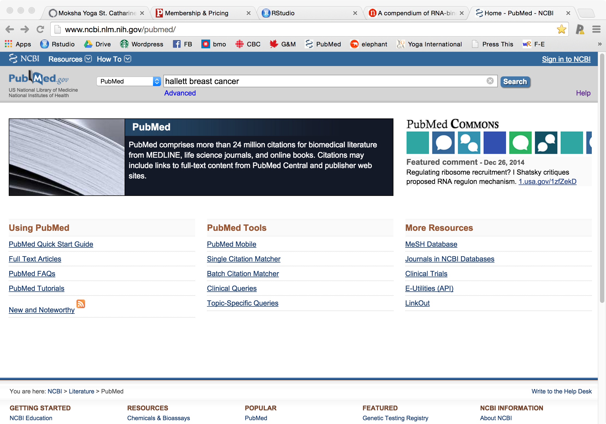
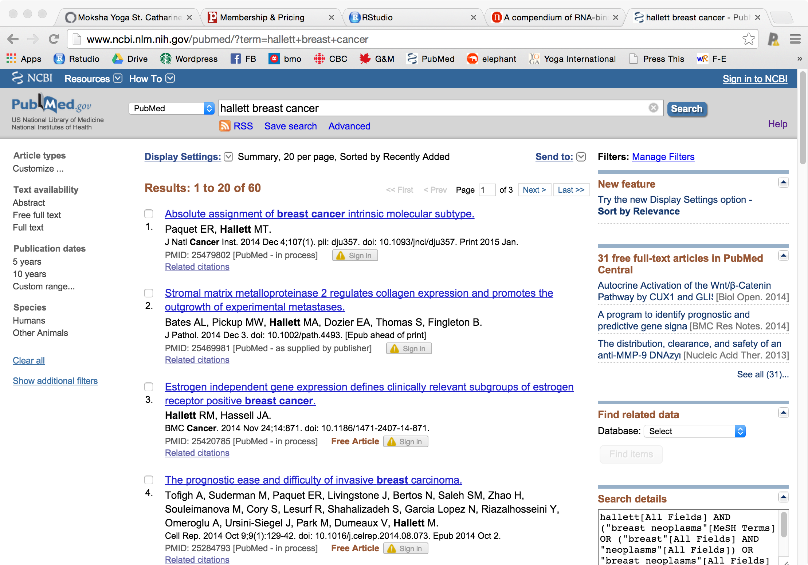
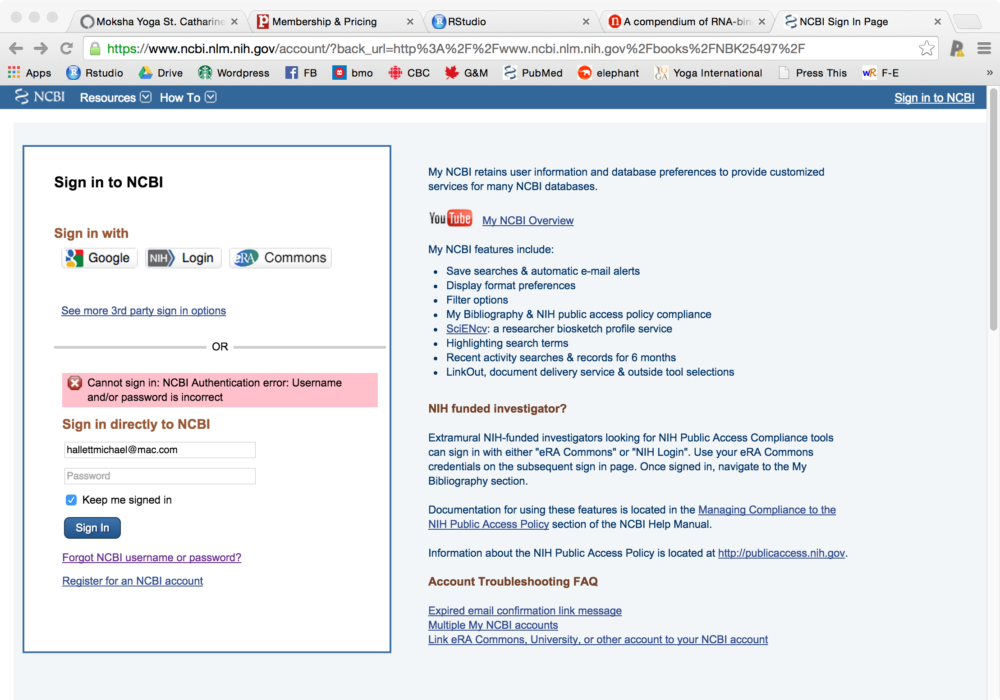
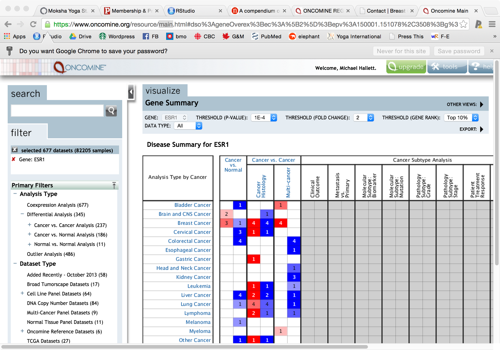

Module 1, Lecture 1: Bioinformatics
========================================================
author: M Hallett
date: January 2016
autosize:true
font-family: 'Helvetica'
#output: beamer-presentation
#title: "Sample Document"
#output: pdf_document

## COMP-364 Tools for the Life Sciences

Logistics
========================================================

[www.bci.mcgill.ca](http://www.bci.mcgill.ca) My lab website 
[www.bci.mcgill.ca/home/?page_id=811](http://www.bci.mcgill.ca/home/?page_id=811) Course Website

MTR 10:35am-11:25am 
ENGTR – Trottier Building 2120 
Jan 7th 2016 – April 15th 2016 

${\tt michael.t.hallett@mcgill.ca}$ 
Office: McIntyre 903 
Office Hours: TBA

Mohamed Ghadie, Teaching Assistant 
${\tt mohamed.ghadie@mail.mcgill.ca}$ 
Office: TBA 
Office Hours: TBA

Course Evaluation & Schedule
========================================================

Exercise        | Due Date                      | % of Grade
----------------|-------------------------------|---------
Assignment 0    | Monday, January 25, 2016    | 10%  
Assignment 1    | Monday February 8, 2016    | 10% 
Assignment 2    | Monday, February 22, 2016  | 10% 
Midterm         | Week of March 7-11, 2016      | 20%
Assignment 3    | Monday, March 21, 2016     | 10%
Assignment 4    | Monday, April 11, 2016    | 10%
Final Exam      | TBA                           | 30% 

Infrastucture & General Notes
========================================================
* If you are registered for this course, you will have a SOCS (School of Comp Sci) account.
* The SOCS account provides you access to the SOCS workstations and server.
* However, your laptop or workstation at home should suffice for the course.
* I can provide additional instruction if someone needs it regarding these machines.

Infrastucture & General Notes (2)
========================================================
* There is some focus on the basic biology of breast cancer.
* There is also a focus on statistics and computation to examine these biologies.
* This requires that you learn some statistics and how they are used to explore systems biology and -omic data.
* This is a heavy programming course, if you have never programmed before.
* But you will know how to program at the end of it.

Infrastucture & General Notes (3)
========================================================
* We are mostly going to use data made available as part of the Breast Cancer TCGA dataset. 
* You will also need to become familiar with RStudio, a programming environment to deal with R and datasets.
* You will also have to become a little bit familiar with a software versioning system called GIT and a website that allows us to save/distribute/manage GIT repositories called BitBucket.
* We will make all the slides, data, code and assignments available via a GIT & BitBucket.

Some advice
========================================================

* Bioinformatics is an experimental science.
* This means that you need to sit down and do experiments.
* The primary means of doing experiments in bioinformatics is through the use of statistics and computation.
* This requires programming.
* Learning to program is like learning a language.
* It is an investment, and I motivate why this investment will change your career.
* Practice and all is coming.

What is Bioinformatics?
========================================================
* The science of biological information
* Managing biological information is a **part** of bioinformatics **but not all**
* Examples: 
  * The use tools from information science to collect and organize biological informatics.
  * e.g. www.yeastgenome.org/ websites that provide comprehensive perspectives of an organism.
  * e.g. Efforts like that NCBI [www.ncbi.nlm.nih.gov](http://www.ncbi.nlm.nih.gov/)
  that contains many different bioinformatics objects like
      + PubMed [www.ncbi.nlm.nih.gov/pubmed](http://www.ncbi.nlm.nih.gov/pubmed) for publications of manuscripts,
      + GenBank [www.ncbi.nlm.nih.gov/genbank](http://www.ncbi.nlm.nih.gov/genbank/) that collects all genes
      + dbGaP [www.ncbi.nlm.nih.gov/gap](http://www.ncbi.nlm.nih.gov/gap) that collects all genotype/phenotype relationships that have been discovered.

Seque: The Importance of Being a Bioinformatician
========================================================

* Bioinformatics tools such as PubMed, GenBank, dbGap and others  facilitate the study of specific genes and gene products by life scientists.
* Consider what life science research looked like  circa 1990 (25 years ago).
* At that time, the vast majority of basic life sci researchers studied a single gene (or gene product), or at most a single complex (e.g. ribosome).
* In '90, How did an ESR (Estrogen Receptor) researcher "track" new results?
* Internet popularized in ~'92. PubMed released in '96. GenBank '88. dbGap '07.
* A lot of actual walking to a library and looking up keywords at the back of a journal that seemed likely to publish results about ESR.
* That is, it was the dark ages. 

Seque (2): And the Geeks shall inherit the earth
========================================================

* Then came the internet in '92. General interconnectivity. Within 5 years, every major journal was publishing their papers on-line.
* Then came PubMed.
* Now virtually every published medical/life science paper was available 
instantly.
* The ability to search text for keywords (eg ESR, estrogen) within english text allowed single genes/gene products to be followed closely.

Seque (3): And the Geeks shall inherit the earth
========================================================

Seque (4): And the Geeks shall inherit the earth
========================================================

Nice Tool: PubMed Automated Searches
========================================================
* Daily email updates for a keyword search.

Seque (5): And the Geeks shall inherit the earth
========================================================

* So Pubmed allowed researchers to identify papers that mentioned a gene (eg ESR). A lot of Principle Investigators (PIs) still primarily and only use PubMed to track their genes.

* But what about results related to ESR that are derived from -omic/systems biology efforts.

* Eg. every time an individual is sequenced, their ESR gene is sequenced and any mutations in this gene add to the global pool of polymorphisms.

* Eg. every time a higher-order eukaroyte is sequenced, a homologue of ESR is sequenced (and may not be named ESR). 

Seque (6): And the Geeks shall inherit the earth
========================================================

* [But what about results related to ESR that are derived from -omic/systems biology efforts.]

* Eg. every time a gene expression microarray is performed on a human sample, ESR levels are of course measured, since these microarrays cover the complete transcriptome. How can we get this information?

* Eg. every time a mass spectrometry experiment is performed to identify proteins or protein interactions, ESR will have be measured too. 

* How can we explore this information? Is there an equivalent of PubMed?

Seque (7): And the Geeks shall inherit the earth
========================================================

* [How can we explore this information? Is there an equivalent of PubMed?]

* First off, how many such studies are there? 1 per year? 5 per year? 

* My daily NCBI automated search for the keyword "breast cancer" retrieves ~15 articles per day.

  * Keyword "genomics" retrives ~90 articles per day.

  * keyword "next generation sequencing" retrieves ~40 per day.

Seque (8): And the Geeks shall inherit the earth
========================================================

* Can researchers afford to ignore this information and only look at the primary research?

* In theory, GenBank '88, dbGap '07 and many other databases provide all of this information. 

* Bioinformatic software was necessary to perform complicated, statistical searches that allow researchers to track their genes in these datasets.

What is Bioinformatics? (2)
========================================================
* The science of biological information
* Managing biological information is a **part** of bioinformatics **but not all**

* Bioinformatics is also the investigation of biological systems using tools from information science.
* For example, my lab considers itself to be a breast cancer research lab whose primary assay is bioinformatics (as opposed to pull downs, PCR, microarray or other assays).
* Often this is about hypothesis testing and biomarker discovery.
* For example, the development of gene panels like Oncotype DX [www.oncotypedx.com](http://www.oncotypedx.com/)

What is Bioinformatics? (3)
========================================================

* And often this is about model building (examples in next slides)
* For example, models of the genome, exome, transcriptome, proteome, protein interactome,  methylomes, epigenome, ... and many other -omic entities.

* Hypothesis testing, biomarkers, and model building all require a tremendous amount of tools from biostatistics and computation.

The Human Genome Project
========================================================

The Human Genome Project
========================================================

The Human Genome Project
========================================================

Then the 1,000 and 10,000 Genome Projects...
========================================================

Catalogues of "functional genomic" information
========================================================

The HapMap project that catalogs single nucleotide polymorphisms and other mutations in human populations.

Catalogues of "functional genomic" information
========================================================

Gene Expression Omnibus and other efforts seek to catalogue transcriptional (mRNA expression levels)

Catalogues of "post-genomic" information
========================================================

The Epigenome project that is attempting to catalogue all epigenetic modifications (e.g. methylation) in different types of human cells (e.g  neuronal versus epithelial vs fibroblasts vs endothelial etc.).

Catalogues of "post-genomic" information
========================================================

Networks that capture which pairs of proteins interact within a cell or organism. Here this is a bacteria (Treponema palladium). Nodes are proteins and edges (lines) connect two proteins that have been determined to interact. Interactions can be between proteins within a complex (e.g. proteins that comprise the ribosome), proteins that phosphorylate other proteins within signalling cascasdes, protein chaperones that help other proteins fold, or ...

Catalogues versus Models
========================================================

* The above examples weren't really bioinformatics specific, but rather genomics, proteomics, systems biology or other -omic challenges.
* These are in large part about technology (to sequence in a massively parallel fashion, mass spectrometry for proteomics/metabolomics, microscopy, other screens ...)
* However they do use the cataloging/organizational aspects that bioinformatics offers.
* In addition to simply collecting and organizing information, the main aim of bioinformatics is to model biological processes...
* ... often using the information provided by these -omic projects.

Catalogues versus Models
========================================================

* The science of biological information
* Managing biological information is a **part** of bioinformatics **but not all**
* Bioinformatics is also a predictive science: 

## Can we build a model that accurately predicts how a biological system will behave?

Consider, the Double Helix Model of DNA
========================================================
.

Historically,biological models are simple and deterministic

***
.

Consider, the Genetic Code
========================================================
.

***
.

There appear to be very few such simple examples
========================================================
* Most biological systems discovered since the double helix and genetic code are hard to capture with such simple models.
* Most systems seem to be highly  non-deterministic , non-specific and  stochastic .
* For example, models of transcription factor binding. [Wasserman and Sandelin (2004) Nature Reviews Genetics.]

Models of Transcription Factor Binding (2)
========================================================
.

***
.

Models of Transcription Factor Binding (3)
========================================================

Or Models of RNA Binding Proteins 
========================================================

The Stochastic Nature of Biological Systems
========================================================
The list goes on and on: 
* the genomic organization of a gene,
* alternative splicing, 
* almost every biological process or response (reponse to stress, starvation, heat shock, cold shock, hypoxia, ...),
* protein translation,
* degradation, 
* protein trafficking, 
* $\ldots$

Probabilistic Models 
========================================================
* Markov chains, Markov processes are common methods to probablisticly model biological processes.
* We will use these in the course.

Hidden Markov Models 
========================================================
* In particular, Hidden Markov Models are extensively used in bioinformatics.

COMP-364 (c) M Hallett, BCI-McGill
========================================================

