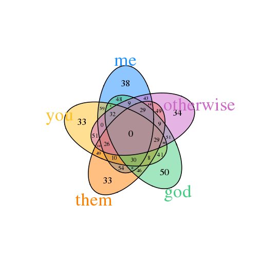
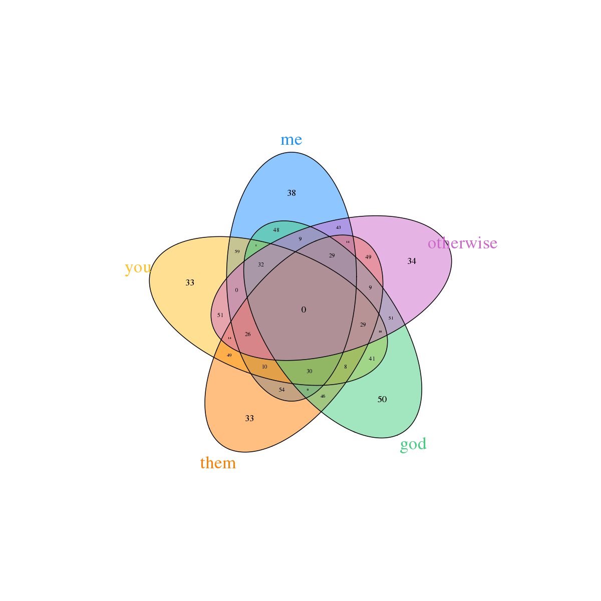

Module 1, Lecture 10: I/O, Libraries/Packages, Bioconductor
========================================================
author: M Hallett
date: January 2015
autosize:true
font-family: 'Helvetica' 
#output: beamer-presentation 

Reading and writing to/from R;
R Libraries & Packages;
The Bioconductor Project

## COMP-364 Tools for the Life Sciences


Previously (Lecture 5) ... Importing a csv file into R
========================================================
- A typical situation is that you have a spreadsheet, or simply a file
that contains information about a set of objects.
- <code>csv</code> is a common code for storing information in files (comma separated values)
- For example, the set of genes that are used in Oncotype Dx. (up in bad outcome)<br>
<tiny><code>
GeneName,Direction
CCNB1,up<br>
MKI67,up<br>
MYBL2,up<br>
AURKA,up<br>
BIRC5,up<br>
ERBB2,up<br>
GRB7,up<br>
CTSL2,up<br>
MMP11,up<br>
CD68,up<br>
BCL2,down<br>
SCUBE2,down<br>
ESR1,down<br>
PGR,down<br>
BAG1,down<br>
GSTM1,down<br>
</code></tiny>


Revisited: Importing a csv file into R (2)
========================================================
- This is your typical csv file that can be generated from Excel, Numbers, etc.
- we assume that this file is named <code>oncotypedx.csv</code>
- we assume it's located in our working directory (eg ~/T4LS)

```r
setwd("~/T4LS/Lectures/MiscFiles")
# first do: help read.csv
oncotype.dx.genes <- read.csv( file ="oncotypedx.csv", header = TRUE, sep = ",")
oncotype.dx.genes[1:5,]
```

```
  GeneName Direction
1    CCNB1        up
2    MKI67        up
3    MYBL2        up
4    AURKA        up
5    BIRC5        up
```

```r
class(oncotype.dx.genes)
```

```
[1] "data.frame"
```

Revisited: Importing a csv file into R (2)
========================================================

```r
attach(oncotype.dx.genes)
class(GeneName); class(Direction) 
```

```
[1] "factor"
```

```
[1] "factor"
```

```r
Direction
```

```
 [1] up   up   up   up   up   up   up   up   up   up   down down down down
[15] down down
Levels: down up
```

```r
detach(oncotype.dx.genes)
```

The read.table() function
========================================================
* csv (comma seperated values) is a common format for data many alternatives exist. 
* In general, the <code>read.table()</code> function with its many parameters handles almost everything.
* Here is a modified version of oncotypedx.csv where "," seperators are replaced by tabs (${\tt \t}$) and there is no header.

<code> 
Unix prompt$ cat oncotypedx.file<br>
CCNB1  up<br>
MKI67	up<br>
MYBL2	up<br>
AURKA	up<br>
BIRC5	up<br>
ERBB2	up<br>
GRB7	up<br>
CTSL2	up<br>
MMP11	up<br>
CD68	up<br>
BCL2	down<br>
SCUBE2	down<br>
ESR1	down<br>
PGR	down<br>
BAG1	down<br>
GSTM1	down<br>
</code>

The read.table() function
========================================================

```r
? read.table 

setwd("~/T4LS/Lectures/MiscFiles")

(oncotype.dx.genes2 <- read.table( 
                        file ="oncotypedx.file", 
                        header = FALSE, 
                        sep = "\t"))
```

```
       V1   V2
1   CCNB1   up
2   MKI67   up
3   MYBL2   up
4   AURKA   up
5   BIRC5   up
6   ERBB2   up
7    GRB7   up
8   CTSL2   up
9   MMP11   up
10   CD68   up
11   BCL2 down
12 SCUBE2 down
13   ESR1 down
14    PGR down
15   BAG1 down
16  GSTM1 down
```

Saving data to file and reading it back in
========================================================

```r
dani <- file("daniel.speaks", "w")  
# open an output file connection

cat("But soft what light", "through yonger window breaks", 
      "it is the east and Katy is my sun", 
      file = dani, sep = "\n")

cat("Two of the sweetest stars in all the heavens ...\n", 
    file = dani)

close(dani)
```
* This text is now in a file called "daniel.speaks" in the working directory (${\tt ~/T4LS/Lecures/MiscFiles}$)
* In Unix in the current working directory, type <code>ls</code> and then <code>cat daniel.speaks</code>.


Saving data to file and reading it back in
========================================================

```r
# now read it back in.
readLines("daniel.speaks")   
```

```
[1] "But soft what light"                             
[2] "through yonger window breaks"                    
[3] "it is the east and Katy is my sun"               
[4] "Two of the sweetest stars in all the heavens ..."
```

```r
# very basic low level function that reads all the text from a connection ("daniel.speaks" in this case)

unlink("daniel.speaks")       
# this deletes the connection. In this case, a file called "daniel.speaks"
```

The write.table() function
========================================================
* An easier way to write to a table 

```r
write.table( oncotype.dx.genes, 
            file = "onco.semicolon", 
            sep = ";", 
            col.names = FALSE)
```

The write.table() function
========================================================
<code> 
Unix prompt$ cat onco.semicolon<br>
* (If we added a <code><font color="blue"> row.names = FALSE </font color></code> parameter, the numbers would disappear.)
<br>
"1";"CCNB1";"up"<br>
"2";"MKI67";"up"<br>
"3";"MYBL2";"up"<br>
"4";"AURKA";"up"<br>
"5";"BIRC5";"up"<br>
"6";"ERBB2";"up"<br>
"7";"GRB7";"up"<br>
"8";"CTSL2";"up"<br>
"9";"MMP11";"up"<br>
"10";"CD68";"up"<br>
"11";"BCL2";"down"<br>
"12";"SCUBE2";"down"<br>
"13";"ESR1";"down"<br>
"14";"PGR";"down"<br>
"15";"BAG1";"down"<br>
"16";"GSTM1";"down"<br>
</code>


The save() and load() functions
========================================================
* These are nice functions that allow you to save to file an R object, and read that R object back in.


```r
(m <- matrix(data = seq(from=1, to=20, by=2 ), nrow = 5, ncol=2))
```

```
     [,1] [,2]
[1,]    1   11
[2,]    3   13
[3,]    5   15
[4,]    7   17
[5,]    9   19
```

```r
(n <- data.frame(first.love="katy", second.love="taylor"))
```

```
  first.love second.love
1       katy      taylor
```

```r
save(m, n, file = "such.a.boring.example")
```

The save() and load() functions
========================================================

```r
m <- NA; n <- NA
m; n
```

```
[1] NA
```

```
[1] NA
```

```r
(my.long.lost.thoughts <- load("such.a.boring.example"))
```

```
[1] "m" "n"
```

```r
n
```

```
  first.love second.love
1       katy      taylor
```

save.image()
======================================================== 
* Related to <code><font color="blue">save()</font color></code> is the <code><font color="blue">save.image()</font color></code> function.
* This function saves your entire R workshop.
* In RStudio, if you have created a project, <code><font color="blue">save.image()</font color></code> is automatically called and stored in a file called <code><font color="blue">.RData</font color></code>
<code> 
Unix prompt$ ls -a<br>
<br>
... <br>
.RData <br>
... <br>
</br>
</code>

The save() and load() functions
========================================================
* (In Unix, files that start with a period (.) are hidden with the <code><font color="blue">ls</font color></code> command by default. 
Use <code><font color="blue">ls -a</font color></code>)


* So when you kill your browser or the R session in RStudio, it makes sure to update the .RData file so that you don't lose your work.


The Libraries of R
========================================================
* All functions and objects in R belong to a <code><font color="blue">package</code></font color>.
* There are currently **6131** packages for R available at [CRAN (Comprehnsive R Archive Network) http://cran.r-project.org/](http://cran.r-project.org/)
* Packages allow related functions/data to be grouped together. You can load only these functions/data when you need them.
* (Consider an R world without packages, or something like packages. How would you find things? If you just loaded _everything_, what would be some problems?)

* To check what packages are currently loaded in your session of R:

```r
search()
```

```
 [1] ".GlobalEnv"        "package:knitr"     "package:stats"    
 [4] "package:graphics"  "package:grDevices" "package:utils"    
 [7] "package:datasets"  "package:methods"   "Autoloads"        
[10] "package:base"     
```

The Libraries of R
========================================================
* With the exception of <code><font color="blue">knitr</code></font color>, these packages are in every R session by default since they are so important and central.
* They are called the *standard* or *base* packages.
* (<code><font color="blue">knitr</code></font color> is a package that RStudio has loaded for me because I am using <code><font color="blue">knitr</code></font color> to make this presentation!)

The Libraries of R
========================================================
* To check what packages are available at our installation of R (the picture below is for me on my private server):

```r
library()
```


The Libraries of R
========================================================
* To check what packages are available at our installation of R (on the pepi.bci.mcgill.ca server):
* And five more pages like this. It's because I use RStudio to develop all of my research projects. Overtime, we use hundreds of diferent packages.
* Because VennDiagram is a package in my library, I can load it easily:


```r
?? Venn 
library(VennDiagram)
? VennDiagram
```
* The easiest thing to do is look up "R Venn Diagram" in Google search for the functions that are available.

The Libraries of R (5D Venn is so Zen)
========================================================

```r
# sample four-set Venn Diagram
set.seed(seed=5)
lst <- list()
lst[[1]] <- sample(1:1000, 400, replace = FALSE)
lst[[2]] <- sample(1:1000, 400, replace = FALSE)
lst[[3]] <- sample(1:1000, 400, replace = FALSE)
lst[[4]] <- sample(1:1000, 400, replace = FALSE)
lst[[5]] <- sample(1:1000, 400, replace = FALSE)
names(lst) <- c("me","you","them","god","otherwise")


venn.plot <- draw.quintuple.venn(
  
  # a lot of parameters!!!
   
  area1 = length(lst[[1]]), area2 = length(lst[[2]]), area3 = length(lst[[3]]), area4 = length(lst[[4]]),
  area5 = length(lst[[5]]),
  n12 = length(intersect(lst[[1]], lst[[2]])),  n13 = length(intersect(lst[[1]], lst[[3]])),
  n14 = length(intersect(lst[[1]], lst[[4]])),  n15 = length(intersect(lst[[1]], lst[[5]])),
  n23 = length(intersect(lst[[2]], lst[[3]])),  n24 = length(intersect(lst[[2]], lst[[4]])),
  n25 = length(intersect(lst[[2]], lst[[5]])),  n34 = length(intersect(lst[[3]], lst[[4]])),
  n35 = length(intersect(lst[[3]], lst[[5]])),  n45 = length(intersect(lst[[4]], lst[[5]])),
  n123 = length(intersect(lst[[1]], intersect(lst[[2]], lst[[3]]))),
  n124 = length(intersect(lst[[1]], intersect(lst[[2]], lst[[4]]))),
  n125 = length(intersect(lst[[1]], intersect(lst[[2]], lst[[5]]))),
  n134 = length(intersect(lst[[1]], intersect(lst[[3]], lst[[4]]))),
  n135 = length(intersect(lst[[1]], intersect(lst[[3]], lst[[5]]))),
  n145 = length(intersect(lst[[1]], intersect(lst[[4]], lst[[5]]))),
  n234 = length(intersect(lst[[2]], intersect(lst[[3]], lst[[4]]))),
  n235 = length(intersect(lst[[2]], intersect(lst[[3]], lst[[5]]))),
  n245 = length(intersect(lst[[2]], intersect(lst[[4]], lst[[5]]))),
  n345 = length(intersect(lst[[3]], intersect(lst[[4]], lst[[5]]))),
  n1234 = length(intersect( lst[[1]], intersect(lst[[2]], intersect(lst[[3]], lst[[4]])))),
  n1235 = length(intersect( lst[[1]], intersect(lst[[2]], intersect(lst[[3]], lst[[5]])))),
  n1245 = length(intersect( lst[[1]], intersect(lst[[2]], intersect(lst[[4]], lst[[5]])))),
  n1345 = length(intersect( lst[[1]], intersect(lst[[3]], intersect(lst[[4]], lst[[5]])))),
  n2345 = length(intersect( lst[[2]], intersect(lst[[3]], intersect(lst[[4]], lst[[5]])))),
  n12345 = length(intersect(lst[[1]], length(intersect( lst[[2]], intersect(lst[[3]], intersect(lst[[4]], lst[[5]])))))),
  category = names(lst),
  fill = c("dodgerblue", "goldenrod1", "darkorange1", "seagreen3", "orchid3"),
  cat.col = c("dodgerblue", "goldenrod1", "darkorange1", "seagreen3", "orchid3"),
  cat.cex = 3.0,
  margin = 0.5,
  cex = c(1.5, 1.5, 1.5, 1.5, 1.5, 1, 0.8, 1, 0.8, 1, 0.8, 1, 0.8, 1, 0.8,
          1, 0.55, 1, 0.55, 1, 0.55, 1, 0.55, 1, 0.55, 1, 1, 1, 1, 1, 1.5),
  ind = TRUE
);
```

 
The Libraries of R (5D Venn is so Zen)
========================================================

```r
png(file = "MyFigs/Quintuple_Venn_diagram.png", width=1200, height=1200);
grid.draw(venn.plot);
dev.off();
```

```
pdf 
  2 
```



The benefits of packages: scoping, public/private functions, etc.
========================================================


Grabbing new packages from CRAN, Bioconductor, or elsewhere
========================================================

* Sometimes R packages that you find on-line or at CRAN aren't in your library locally.
* CRAN has 6131 packages to chose from.
* The <code><font color="blue">install.packages</font color></code> function downloads the package f

```r
# install.packages("MASS")   # in this course you won't need to install such packages this way.
```
 
* Bioconductor has a different mandate than CRAN but it too offers a wide range of packages. 
* Bioconductor is designed to offer functionality for -omics data.
* Although not 100% restricted to R, it is essentially the place where bioinformatics is developed in R.
* There are specific functions to grab packages and install the Bioconductor system.

Bioconductor
========================================================


```r
source("http://bioconductor.org/biocLite.R")
biocLite()
```


Bioconductor
========================================================


[Link to BioC packages](http://www.bioconductor.org/packages/release/BiocViews.html#___Software)


Bioconductor
========================================================


Bioconductor
========================================================
* The <code><font color="blue">biocLite</font color></code> function makes added and updated BioC packages easy:

```r
biocLite(c("GenomicFeatures", "AnnotationDbi"))
```

```

The downloaded source packages are in
	'/tmp/RtmpVf9dhF/downloaded_packages'
```
 
COMP-364 (c) M Hallett, BCI-McGill
========================================================


