Module1, Lecture 4: Basics of R
========================================================
author: M Hallett
date: January 2016
autosize:true
font-family: 'Helvetica' 

## vectors, matrices, arrays, lists


R: help
========================================================
* Different forms of help in R but also use google.

```r
? matrix
help(matrix)
?? matrix
```

R: help
========================================================
* In RStudio, the result of your help query is in the bottomright window

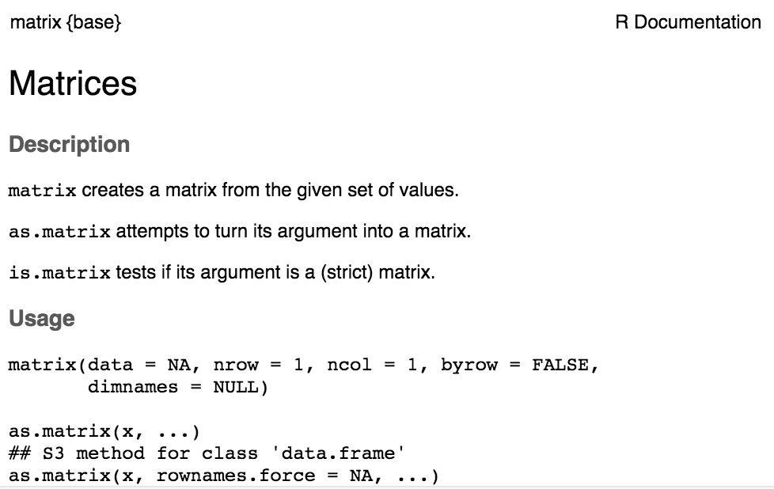

R: example
========================================================

- The <font color=blue><code>example()</code></font color> function (fnc) runs the examples in its help file.


```r
example(matrix)
```

```

matrix> is.matrix(as.matrix(1:10))
[1] TRUE

matrix> !is.matrix(warpbreaks)  # data.frame, NOT matrix!
[1] TRUE

matrix> warpbreaks[1:10,]
   breaks wool tension
1      26    A       L
2      30    A       L
3      54    A       L
4      25    A       L
5      70    A       L
6      52    A       L
7      51    A       L
8      26    A       L
9      67    A       L
10     18    A       M

matrix> as.matrix(warpbreaks[1:10,])  # using as.matrix.data.frame(.) method
   breaks wool tension
1  "26"   "A"  "L"    
2  "30"   "A"  "L"    
3  "54"   "A"  "L"    
4  "25"   "A"  "L"    
5  "70"   "A"  "L"    
6  "52"   "A"  "L"    
7  "51"   "A"  "L"    
8  "26"   "A"  "L"    
9  "67"   "A"  "L"    
10 "18"   "A"  "M"    

matrix> ## Example of setting row and column names
matrix> mdat <- matrix(c(1,2,3, 11,12,13), nrow = 2, ncol = 3, byrow = TRUE,
matrix+                dimnames = list(c("row1", "row2"),
matrix+                                c("C.1", "C.2", "C.3")))

matrix> mdat
     C.1 C.2 C.3
row1   1   2   3
row2  11  12  13
```


R: simple arithmetic 
========================================================

```r
2+2 * 3 - 4 / (5 ^ 6) * sqrt(8)
```

```
[1] 7.999276
```

```r
log(18, base=2)
```

```
[1] 4.169925
```

```r
log(32, base=exp(1))
```

```
[1] 3.465736
```

```r
# a comment: exp(1) = e 
# everything after # is ignored by R on a line
```

R: variables of type numeric and  integer 
========================================================
.


```r
x <- 7.1 # numeric
y <- 7 # integer
x*y
```

```
[1] 49.7
```
***
.


```r
class(x)
```

```
[1] "numeric"
```

```r
class(y)
```

```
[1] "numeric"
```

```r
x == y # double == means a test for equality
```

```
[1] FALSE
```

R: variables of type numeric and  integer 
========================================================
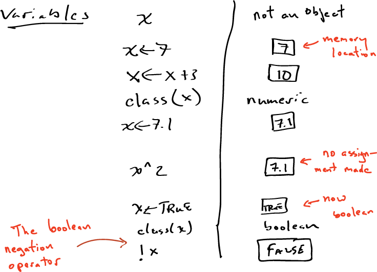

R: objects
========================================================
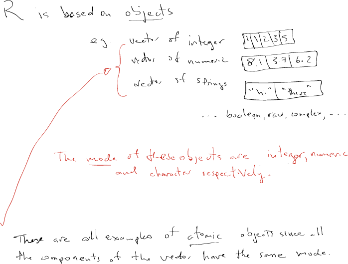


R: boolean type and operators
========================================================
.
.


```r
x <- TRUE; y <- !x; class(x)
```

```
[1] "logical"
```

```r
(x == !y)
```

```
[1] TRUE
```

```r
(x != y)
```

```
[1] TRUE
```

```r
(!x == y)
```

```
[1] TRUE
```
***
.


```r
x <- TRUE
y <- FALSE
(x & y); (x | y); (x & !y); xor(x, y)
```

```
[1] FALSE
```

```
[1] TRUE
```

```
[1] TRUE
```

```
[1] TRUE
```

R: assignment vs. tests of equality
========================================================

```r
x <- 5
5 -> x
y = 5 # same deal as <-
x == y # boolean test of equality
```

```
[1] TRUE
```

```r
z <- NA # Not Available (missing value)
is.na(z)
```

```
[1] TRUE
```

```r
8/0 # huh?
```

```
[1] Inf
```
R: characters
========================================================

```r
x <- "abc"
class(x)
```

```
[1] "character"
```

```r
y <- "def"
(x == y)
```

```
[1] FALSE
```

```r
cat(x, y)
```

```
abc def
```


R: formulas
========================================================

```r
form <- y ~ x*z + b + epsilon
class(form)
```

```
[1] "formula"
```

R: formulas
========================================================
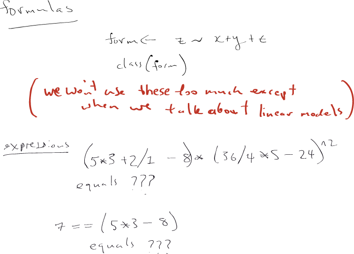


R: some important misc. things
========================================================


```r
#quit()  (but you have to remove the # at the beginning)
```
If you are using RStudio, it takes care of saving your work space
```

R: some important misc. things
========================================================
.

setwd("~/repos/comp364")  
  # sets working directory
y <- 11 
  # assign y to be 11

sink("my.private.file.R") 
  # sink sends output to file

cat("y <- 11")  


sink()  # back to terminal
```
***
```
y <- 0  
y
[1] 0

source("my.private.file.R")

y
[1] 11

```

R: more important misc. things
========================================================

```r
(x <- 7) # the parantheses tell R to print out the result of the expression
```

```
[1] 7
```

```r
ls()  # tells you all the objects in your current R session
```

```
[1] "form" "mdat" "x"    "y"    "z"   
```

```r
rm(x); ls()   # the semicolon can be used to separate commands in R
```

```
[1] "form" "mdat" "y"    "z"   
```


Interrupting an R session: an infinite loop
======================================================== 
<font color="blue"><code><small>
while (1 < 2) { print("Hello World") }
</small></code></font color>

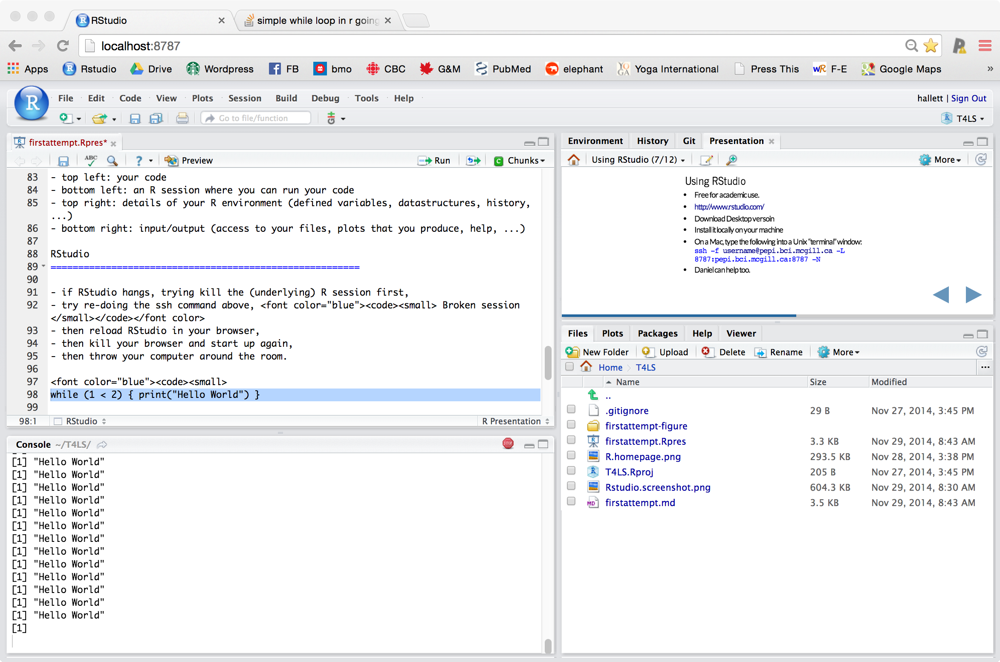


R: combine operator c
========================================================

```r
x <- c( 1:5 )
y <- c( rep( "hi", times=5 ) ) # repeats the string 5 times
z <- c( sample(1:10) ) # a random permutation of 1 through 10
x; y; z
```

```
[1] 1 2 3 4 5
```

```
[1] "hi" "hi" "hi" "hi" "hi"
```

```
 [1]  5  9  6  8  4 10  2  3  7  1
```

```r
w <- c( x, y, z)
w
```

```
 [1] "1"  "2"  "3"  "4"  "5"  "hi" "hi" "hi" "hi" "hi" "5"  "9"  "6"  "8" 
[15] "4"  "10" "2"  "3"  "7"  "1" 
```
R: combine operator c
========================================================
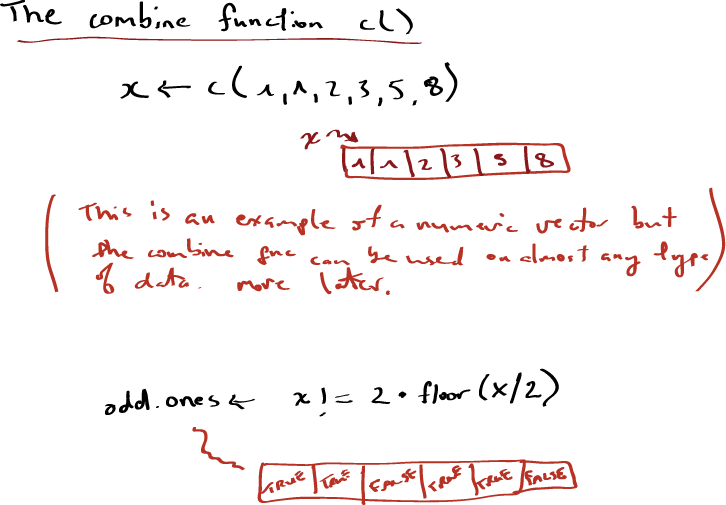


R: simple set operations
========================================================
.


```r
(x <- c(sort(sample(1:10, 5))))
```

```
[1]  1  3  4  6 10
```

```r
(y <- c(sort(sample(5:15, 5))))
```

```
[1]  5  6  7  8 13
```

```r
intersect(x,y)
```

```
[1] 6
```

```r
union(x,y)
```

```
[1]  1  3  4  6 10  5  7  8 13
```
***

```r
setequal( intersect(x, y), intersect(y, x) )
```

```
[1] TRUE
```

```r
setdiff(y, x); setdiff(x, y)
```

```
[1]  5  7  8 13
```

```
[1]  1  3  4 10
```

```r
is.element( 3, y )
```

```
[1] FALSE
```

R: naming elements
========================================================
.

```r
bio.molecules <- c( 20000, 200000, 150000)
names(bio.molecules) <- 
      c(
        "genes", "exons", "proteins"  )
bio.molecules
```

```
   genes    exons proteins 
   20000   200000   150000 
```

```r
bio.molecules[3]
```

```
proteins 
  150000 
```
***

```r
names(bio.molecules[2])
```

```
[1] "exons"
```

```r
bio.molecules["exons"]
```

```
exons 
2e+05 
```

```r
bio.molecules["genes"] <- 14000
```


R: vectors
========================================================
A one-dimensional list of objects with the same type/mode (e.g. numeric)

```r
fibonacci.numbers <- c(1, 1, 2, 3, 5, 8)
fibonacci.numbers[3]            # just the 3rd number in the sequence
```

```
[1] 2
```

```r
fibonacci.numbers[3:5]          # the 3rd through 5th
```

```
[1] 2 3 5
```

```r
fibonacci.numbers[-(3:5)]       # everything except the 3rd, 4th, and 5th.
```

```
[1] 1 1 8
```

R: vectors
========================================================

```r
zeroed.integer.vector <- vector( mode="integer", length=6 )

zeroed.integer.vector[3] <- 2
zeroed.integer.vector
```

```
[1] 0 0 2 0 0 0
```


R: vectors
========================================================

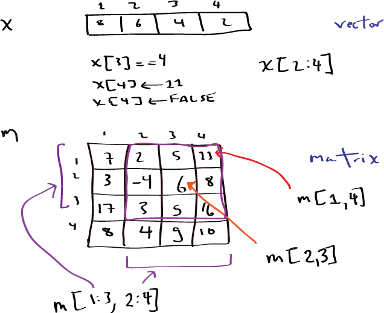


R: matrices
========================================================
.

A two-dimensional list of objects with the same type/mode (e.g. numeric)

```r
(A <- matrix( c(5, 7.7, 3.2, 18, 1.7, 9.8, 1.3, 7.3, 8.8), nrow=3, ncol=3))
```

```
     [,1] [,2] [,3]
[1,]  5.0 18.0  1.3
[2,]  7.7  1.7  7.3
[3,]  3.2  9.8  8.8
```

```r
(B <- matrix( c(17.3, 8, 14.2, 9, 3, 2), nrow=3, ncol=2))
```

```
     [,1] [,2]
[1,] 17.3    9
[2,]  8.0    3
[3,] 14.2    2
```
***

```r
A*2   # simple scalar mutliplication
```

```
     [,1] [,2] [,3]
[1,] 10.0 36.0  2.6
[2,] 15.4  3.4 14.6
[3,]  6.4 19.6 17.6
```

R: matrices
========================================================
.


```r
t(A)  # transpose of m
```

```
     [,1] [,2] [,3]
[1,]  5.0  7.7  3.2
[2,] 18.0  1.7  9.8
[3,]  1.3  7.3  8.8
```

```r
A * t(A) # element by element products (since both are same size)
```

```
       [,1]   [,2]  [,3]
[1,]  25.00 138.60  4.16
[2,] 138.60   2.89 71.54
[3,]   4.16  71.54 77.44
```
***

```r
A %*% B
```

```
       [,1]  [,2]
[1,] 248.96 101.6
[2,] 250.47  89.0
[3,] 258.72  75.8
```


R: matrices
========================================================
A two-dimensional list of objects with the same type/mode (e.g. numeric)


```r
A
```

```
     [,1] [,2] [,3]
[1,]  5.0 18.0  1.3
[2,]  7.7  1.7  7.3
[3,]  3.2  9.8  8.8
```

```r
b <- c(1.4, 8, 6.3)
# we want to solve for x where A %*% x = b
xxx <- solve(A, b)
xxx
```

```
[1]  0.43447311 -0.09048063  0.65868139
```

R: matrices
========================================================
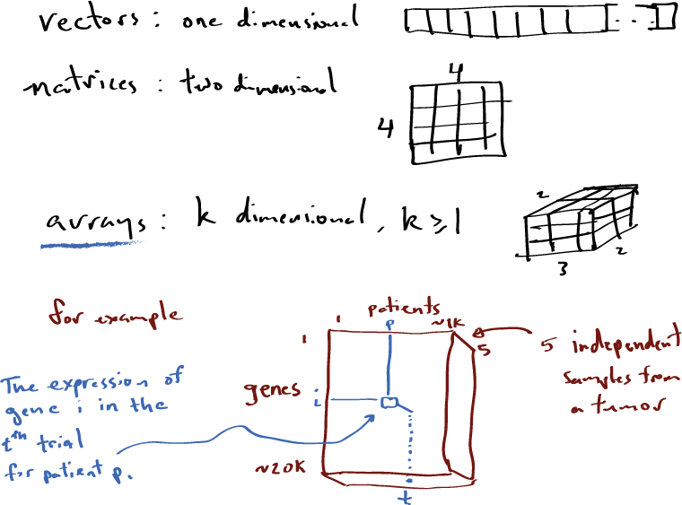


R: arrays
========================================================
.

For $k \geq 1$, a $k$-dimensional list of objects with the same type/mode (e.g. numeric)

```r
RNAseq.data <- array(
 data = rnorm(4*3*2, mean=0, sd=2),
 dim=c(4,3,2),
dimname=c("genes","patients","trials")
)

print(RNAseq.data[,,1], digits=3)
```

```
       [,1]    [,2]    [,3]
[1,] -2.471 -2.5110  1.2101
[2,]  0.541  1.3052 -3.1974
[3,]  4.453  0.0762  2.4243
[4,]  0.750  1.5814  0.0117
```
***

```r
print(RNAseq.data[,,2], digits=3)
```

```
       [,1]   [,2]   [,3]
[1,] -0.100 -0.746 -0.860
[2,] -2.519 -3.349  0.218
[3,]  1.658  1.757  2.154
[4,]  0.317 -5.844  0.532
```

```r
print(RNAseq.data[,1,], digits=3)
```

```
       [,1]   [,2]
[1,] -2.471 -0.100
[2,]  0.541 -2.519
[3,]  4.453  1.658
[4,]  0.750  0.317
```

R: lists
========================================================
.


```r
patient <- list( "Jane Doe", 81, TRUE, 3, c(0, 0, 1))
# patient[[1]] corresponds to patient name
# patient[[2]] is age
# patient[[3]] is post-menopausal?
# patient[[4]] number of lymph nodes (LN) examined
# patient[[5]] is list of length(patient[[4]]) 
#   here  0 is LN-, and 1 LN+
```
***

```r
patient
```

```
[[1]]
[1] "Jane Doe"

[[2]]
[1] 81

[[3]]
[1] TRUE

[[4]]
[1] 3

[[5]]
[1] 0 0 1
```

R: lists
========================================================
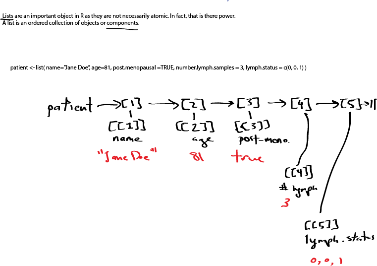


R: lists (with names)
========================================================
.


```r
patient <- list( 
    name = "Jane Doe", 
    age=81, 
    post.menopausal = TRUE, 
    number.lymph.samples = 3,
    lymph.status = c(0, 0, 1))
```
***

```r
patient
```

```
$name
[1] "Jane Doe"

$age
[1] 81

$post.menopausal
[1] TRUE

$number.lymph.samples
[1] 3

$lymph.status
[1] 0 0 1
```

R: lists within lists
========================================================
.


```r
patient <- list( 
  list("Jane", "Doe", "ReMiFaSoLa"), 
  81, 
  TRUE, 
  3, 
  c(0, 0, 1)
)
```
***

```r
patient
```

```
[[1]]
[[1]][[1]]
[1] "Jane"

[[1]][[2]]
[1] "Doe"

[[1]][[3]]
[1] "ReMiFaSoLa"


[[2]]
[1] 81

[[3]]
[1] TRUE

[[4]]
[1] 3

[[5]]
[1] 0 0 1
```

R: lists within lists (how to "index")
========================================================
.


```r
patient <- list( list("Jane", "Doe", "ReMiFaSoLa"), 81, TRUE, 3, c(0, 0, 1))

patient[[1]]
```

```
[[1]]
[1] "Jane"

[[2]]
[1] "Doe"

[[3]]
[1] "ReMiFaSoLa"
```
***
.


```r
patient[[1]][[2]]
```

```
[1] "Doe"
```

```r
patient[[5]]
```

```
[1] 0 0 1
```

```r
patient[[5]][3]
```

```
[1] 1
```

R: lists within lists (indexing is easier with names)
========================================================
.


```r
patient <- list( 
  name = list(
        first="Jane", 
        last="Doe", 
        maiden="ReMiFaSoLa"), 
  age=81, 
  post.menopausal = TRUE, 
  number.lymph.samples = 3, 
  lymph.status = c(0, 0, 1)
)
```
***
.


```r
patient
```

```
$name
$name$first
[1] "Jane"

$name$last
[1] "Doe"

$name$maiden
[1] "ReMiFaSoLa"


$age
[1] 81

$post.menopausal
[1] TRUE

$number.lymph.samples
[1] 3

$lymph.status
[1] 0 0 1
```

R: lists within lists (indexing is easier with names)
========================================================
.


```r
patient <- list( 
  name = list(
    first="Jane", 
    last="Doe", 
    maiden="ReMiFaSoLa"), 
  age=81, 
  post.menopausal = TRUE, 
  number.lymph.samples = 3, 
  lymph.status = c(0, 0, 1)
)
patient$name$lastpatient$lymph.status
```

```
NULL
```

```r
patient$lymph.status[3]
```

```
[1] 1
```
***
.


```r
patient$name
```

```
$first
[1] "Jane"

$last
[1] "Doe"

$maiden
[1] "ReMiFaSoLa"
```

R: lists
========================================================
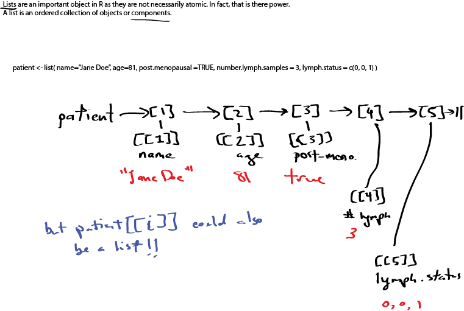

R: lists
========================================================
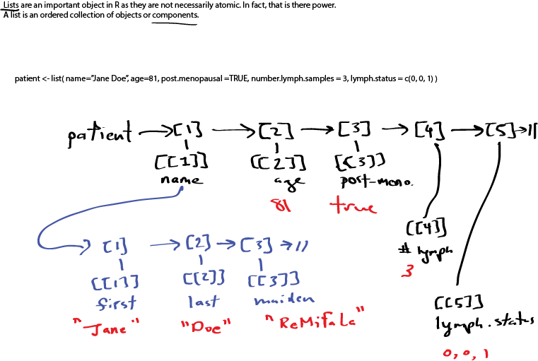

R: lists
========================================================
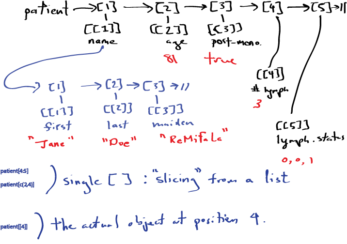

R: lists
========================================================
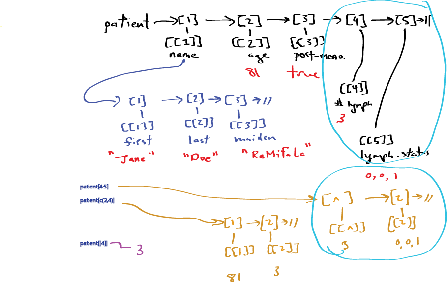

R: lists
========================================================
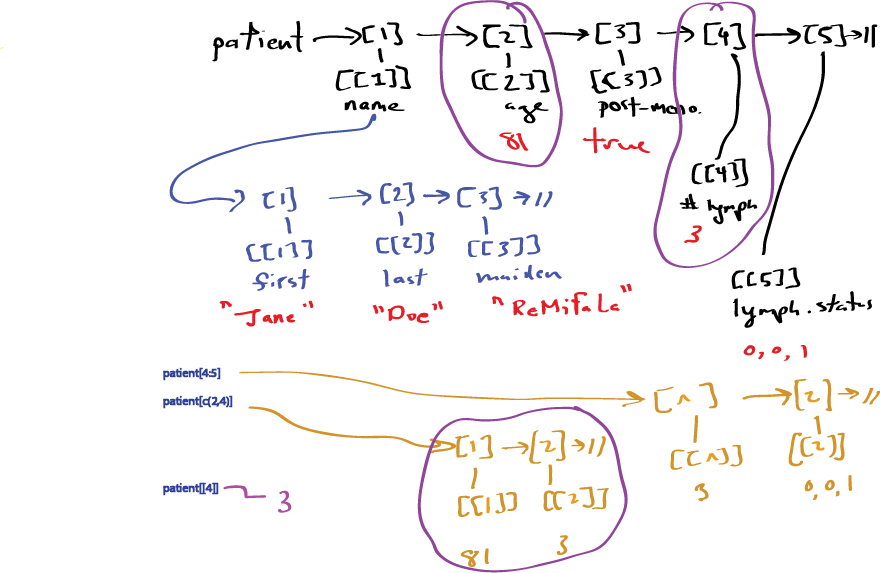


R: [ ] versus [[ ]]
========================================================
.

The single square brackets returns a list; that is, a "slice" of the original list.

```r
patient <- list( 
  list(
    "Jane", 
    "Doe", 
    "ReMiFaSoLa"), 
  81, TRUE, 3, 
  c(0, 0, 1)
)

patient[2]    # in this case the slice is just the 2nd element.
```

```
[[1]]
[1] 81
```
***

```r
patient[3:4]  #  restricted to only the 3rd and 4th elements.
```

```
[[1]]
[1] TRUE

[[2]]
[1] 3
```


R: [ ] versus [[ ]]
========================================================
.

The double square brackets returns the object in the list. This is what you most of the time want

```r
patient <- list( 
  list(
    "Jane", 
    "Doe", 
    "ReMiFaSoLa"), 
  81, TRUE, 3, 
  c(0, 0, 1))

patient[[2]]
```

```
[1] 81
```

```r
# patient[[3:4]]  This won't work 
# patient[[c(2,5)]]  This won't work either!
```


R: copying
========================================================

```r
name.info <- list( first="Jane", last="Doe", maiden="ReMiFaSoLa" )

patient <- list( name=name.info,
      age=81,
      post.menopausal = TRUE,
      number.lymph.samples = 3,
      lymph.status = c(0, 0, 1))

patient$name$first <- "Jannette"

# what is name.info$first equal to now?
```

R: copying (answer)
========================================================

```r
name.info$first
```

```
[1] "Jane"
```

```r
patient$name$first
```

```
[1] "Jannette"
```

In general, almost everything in R is copied when assigned.

R: c() versus list() concatenation
========================================================

```r
patient2 <- list(
  name = list(
          first="Katy",
          last="Perry",
          maiden="Hudson" ),
          # Hudson is her real name
  age = 30,
  # she turns 31 on October 25th
  post.menopausal = FALSE,
  number.lymph.samples = 0,
  lymph.status = c(0, 0, 0)
)
# Daniel's favourite singer
# well sometimes it's Taylor Swift
```

R: c() versus list() concatenation
========================================================

```r
weird.database <- c( patient, patient2 )
length(weird.database)
```

```
[1] 10
```

```r
names(weird.database)
```

```
 [1] "name"                 "age"                  "post.menopausal"     
 [4] "number.lymph.samples" "lymph.status"         "name"                
 [7] "age"                  "post.menopausal"      "number.lymph.samples"
[10] "lymph.status"        
```

```r
weird.database$name
```

```
$first
[1] "Jannette"

$last
[1] "Doe"

$maiden
[1] "ReMiFaSoLa"
```


R: c() versus list() concatenation
========================================================
* Switch from c() to list().

```r
patient.database <- list( patient, patient2 )
length(patient.database)
```

```
[1] 2
```

```r
patient.database[[1]]$name$first
```

```
[1] "Jannette"
```

```r
patient.database[[2]]$name$first
```

```
[1] "Katy"
```

R: handy feature
========================================================
.


```r
my.list <- list()  # generic empty list

my.list
```

```
list()
```
Why is this handy sometimes?!? 

Because.
***

```r
my.list[[3]] <- 17

my.list
```

```
[[1]]
NULL

[[2]]
NULL

[[3]]
[1] 17
```


COMP-364 & COMP-618 (c) M Hallett, BCI-McGill
========================================================
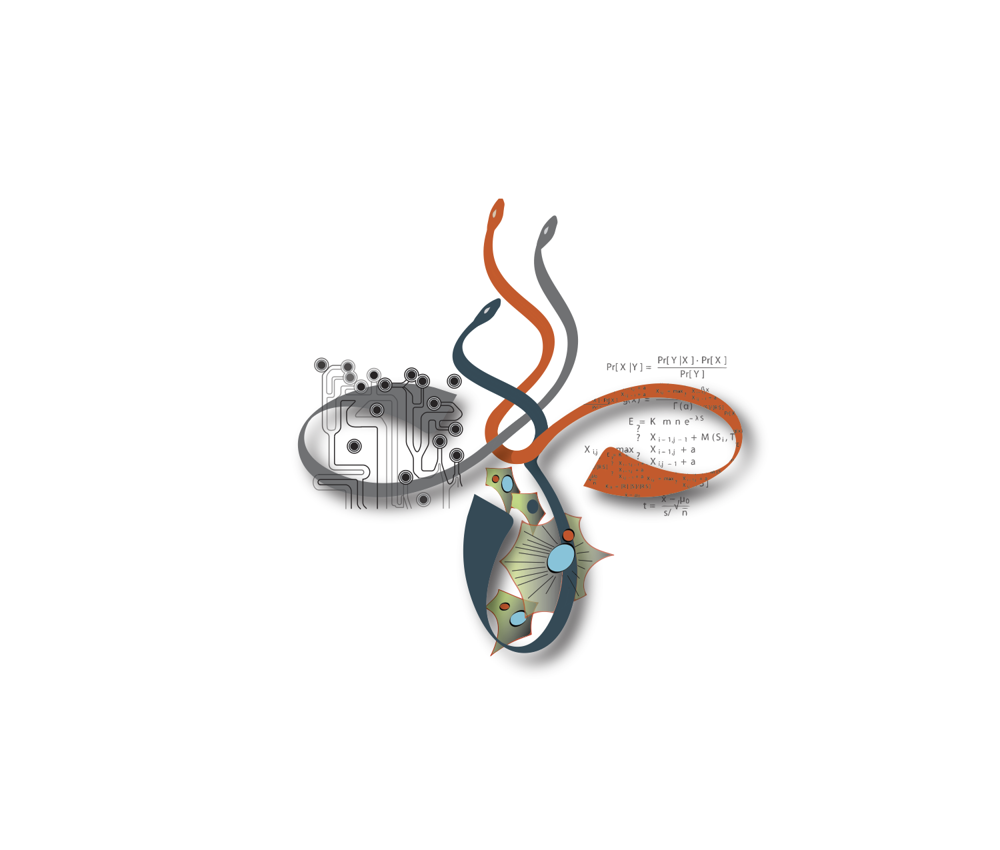


