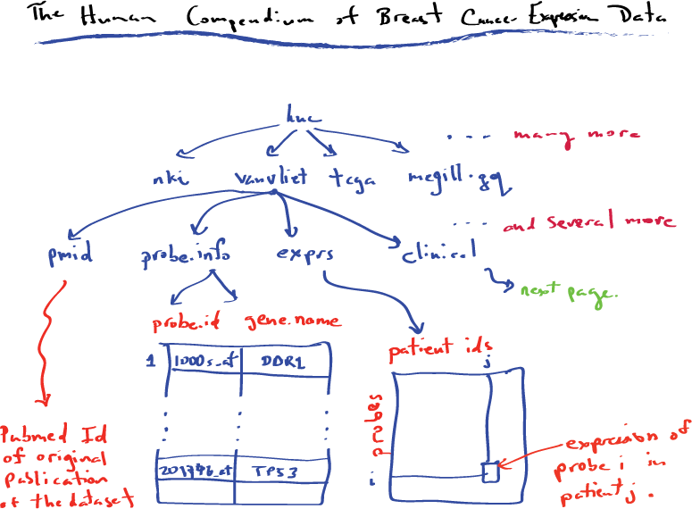
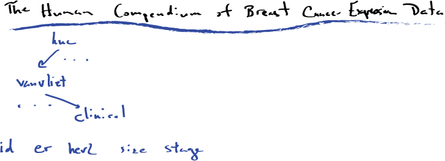
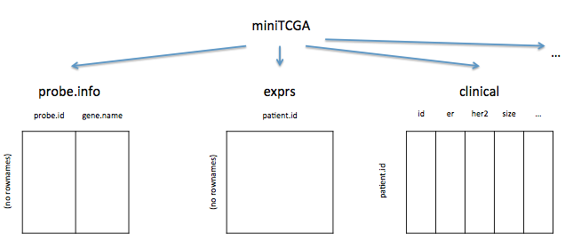
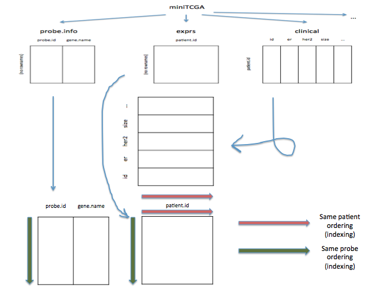

Module1, Lecture 6: The Human Compendium (Huc) of Expression
========================================================
author: M Hallett
date: January 2016
autosize:true
font-family: 'Helvetica' 
#output: beamer-presentation 

## gene expression, R datastructures for storing patient clinical and expression data.


The Human Compendium (HuC)
========================================================
- Throughout this course, we will examine breast cancer -omic datasets.
- We've made available a compendium of some available gene
expression datasets.
- It is organized as an R data.frame.
- First we load a file which contains a set of functions that we wrote to load and process the
HuC into R.

```r
source("~/repos/comp364/src/hucMini.R")
```

The Human Compendium (HuC)
========================================================
- We can check the functions available now

```r
ls()
```

```
 [1] "bresect.name.map"              "dataDir"                      
 [3] "heatmap.clinical"              "heatmap.color.scheme"         
 [5] "heatmap.ddr"                   "heatmap.is.valid.color.scheme"
 [7] "heatmap.key"                   "heatmap.labels"               
 [9] "heatmap.labels.cex"            "heatmap.map"                  
[11] "heatmap.mark"                  "heatmap.simple"               
[13] "heatmap.simple.html.map"       "heatmap.underline.column"     
[15] "heatmap.underline.row"         "huc.clinical.colors"          
[17] "huc.color.clinical"            "huc.load"                     
[19] "huc.ls"                        "layout.mat.html.map"          
```
The Human Compendium (HuC) (2)
========================================================
Let's load three datasets for now

```r
dataset.collections <- c("miniTCGA", "vanvliet", "nki") 
huc <- huc.load(dataset.collections, "~/repos/comp364/data") # for you change this to 
names(huc)
```

```
[1] "miniTCGA" "vanvliet" "nki"     
```

```r
names(huc$miniTCGA)
```

```
[1] "clinical"   "probe.info" "exprs"     
```

```r
names(huc$miniTCGA$clinical)
```

```
 [1] "id"            "id.orig"       "geo.sample"    "er"           
 [5] "her2"          "size"          "stage"         "grade"        
 [9] "lymph"         "age"           "time"          "event"        
[13] "time.5"        "event.5"       "chemo"         "tamoxifen"    
[17] "herceptin"     "intclust"      "type"          "pam50.authors"
[21] "pam50.inhouse" "pam50.genefu"  "claudin.low"   "lehmann"      
[25] "cit"          
```

The Human Compendium (HuC): hucMini.R
========================================================

* Other types besides mRNA expression can be loaded by the huc.load() function
* Read the Comments at the begining of hucMini.R
* More later.

```r
  ## Args:
  ##  dataSets  : Which data set(s) we should load from.

  ##                  miniTCGA 
  ##                  vanvliet
  ##                  nki
  ##                  curtis.validation
  ##                  curtis.discovery
  ## TODO             mcgill.gq
  ##
  ##  dataDir   : The data directory in the cloned repo
  ##  dataTypes : Vector of what you would like to load per
  ##              dataset.
  ##              Supports:
  ##                  exprs           - Gene expression
  ##                  cnv             - Copy number variations
  ##                  somatic.curated - Curated somatic mutations
  ## TODO             rna-seq         - RNA Seq data
  ## TODO             dna-seq         - DNA Seq data
  ##                  all             - All available types
  ##                  none            - Loads only the clinical data.
  ##
```


The Human Compendium (HuC) (3)
========================================================


The Human Compendium (HuC) (3)
========================================================


The Human Compendium (HuC) (4)
========================================================


The Human Compendium (HuC) (5)
========================================================



The Human Compendium (HuC) (6)
========================================================

```r
names(huc$miniTCGA$clinical)
```

```
 [1] "id"            "id.orig"       "geo.sample"    "er"           
 [5] "her2"          "size"          "stage"         "grade"        
 [9] "lymph"         "age"           "time"          "event"        
[13] "time.5"        "event.5"       "chemo"         "tamoxifen"    
[17] "herceptin"     "intclust"      "type"          "pam50.authors"
[21] "pam50.inhouse" "pam50.genefu"  "claudin.low"   "lehmann"      
[25] "cit"          
```

```r
huc$miniTCGA$clinical[1:10, c("er", "her2", "event.5", "lymph", "chemo", "herceptin")]
```

```
            er  her2 event.5 lymph chemo herceptin
tcga.79   TRUE FALSE   FALSE FALSE    NA        NA
tcga.85  FALSE FALSE   FALSE    NA    NA        NA
tcga.155  TRUE    NA   FALSE  TRUE    NA        NA
tcga.245  TRUE FALSE   FALSE  TRUE    NA        NA
tcga.301  TRUE    NA   FALSE FALSE    NA        NA
tcga.375  TRUE FALSE   FALSE FALSE    NA        NA
tcga.377  TRUE FALSE   FALSE FALSE    NA        NA
tcga.378    NA    NA      NA    NA    NA        NA
tcga.379    NA    NA      NA    NA    NA        NA
tcga.380    NA    NA      NA    NA    NA        NA
```

 HuC (7)
========================================================

```r
huc$vanvliet$clinical[1:10, c("er", "her2", "event.5", "lymph", "chemo", "herceptin")]
```

```
               er  her2 event.5 lymph chemo herceptin
vanvliet.1  FALSE FALSE    TRUE FALSE    NA        NA
vanvliet.2   TRUE FALSE   FALSE FALSE    NA        NA
vanvliet.3  FALSE FALSE    TRUE FALSE    NA        NA
vanvliet.4   TRUE FALSE   FALSE FALSE    NA        NA
vanvliet.5   TRUE FALSE   FALSE FALSE    NA        NA
vanvliet.6   TRUE FALSE   FALSE FALSE    NA        NA
vanvliet.7  FALSE FALSE   FALSE FALSE    NA        NA
vanvliet.8   TRUE FALSE   FALSE FALSE    NA        NA
vanvliet.9   TRUE FALSE   FALSE FALSE    NA        NA
vanvliet.10  TRUE FALSE    TRUE FALSE    NA        NA
```

HuC (8)
========================================================

```r
names(huc$miniTCGA)
```

```
[1] "clinical"   "probe.info" "exprs"     
```

```r
length(huc$miniTCGA$exprs[1,]) # number of patients
```

```
[1] 93
```

```r
huc$miniTCGA$exprs[1:10, 1:5]
```

```
      tcga.79 tcga.85 tcga.155 tcga.245 tcga.301
 [1,]  1.9590  0.0520  -1.1110   2.0080   0.2845
 [2,] -0.0375  0.4180  -1.2420  -0.7255   0.2255
 [3,]  1.6970  2.7890   0.4770   1.2900   0.1305
 [4,] -2.5870 -1.6455  -3.4275  -2.7755  -2.5055
 [5,] -0.6985 -0.0285   1.8380  -0.0650   0.5670
 [6,] -0.1985  0.3500   0.0465   0.0675   0.2855
 [7,]  0.4300  0.1225  -0.3495   0.0675   0.1685
 [8,]  0.4295  0.1375   0.5830   0.5585   0.1090
 [9,] -1.5080 -0.9835  -0.0645  -0.6045  -0.0635
[10,]  0.7565 -0.0065  -0.1590   0.8440   0.9635
```

HuC (9)
========================================================

```r
names(huc$miniTCGA)
```

```
[1] "clinical"   "probe.info" "exprs"     
```

```r
length(huc$miniTCGA$probe.info[,1]) # number of genes
```

```
[1] 90797
```

```r
huc$miniTCGA$probe.info[1:10, ]
```

```
       probe.id    gene.name
1  A_23_P100002      FAM174B
2  A_23_P100013        AP3S2
3  A_23_P100020 LOC100128403
4  A_23_P100053       RBPMS2
5  A_23_P100072         AVEN
6  A_23_P100093      ZSCAN29
7  A_23_P100100        VPS39
8  A_23_P100114          CHP
9  A_23_P100129        CASC5
10 A_23_P100131        ATMIN
```


HuC (10)
========================================================

```r
names(huc$vanvliet)
```

```
[1] "clinical"   "probe.info" "exprs"     
```

```r
attach(huc$vanvliet)
length(subset(clinical, er))
```

```
[1] 25
```

```r
length(subset(clinical, !er & !her2))
```

```
[1] 25
```
HuC (10)
========================================================

```r
  subset(clinical, !er & !her2 & lymph)
```

```
                       id                          id.orig geo.sample
vanvliet.151 vanvliet.151                         GSM79117   GSM79117
vanvliet.181 vanvliet.181                         GSM79147   GSM79147
vanvliet.216 vanvliet.216                         GSM79183   GSM79183
vanvliet.217 vanvliet.217                         GSM79184   GSM79184
vanvliet.227 vanvliet.227                         GSM79195   GSM79195
vanvliet.228 vanvliet.228                         GSM79196   GSM79196
vanvliet.234 vanvliet.234                         GSM79202   GSM79202
vanvliet.259 vanvliet.259                         GSM79227   GSM79227
vanvliet.267 vanvliet.267                         GSM79235   GSM79235
vanvliet.279 vanvliet.279                         GSM79247   GSM79247
vanvliet.303 vanvliet.303                         GSM79271   GSM79271
vanvliet.319 vanvliet.319                         GSM79287   GSM79287
vanvliet.337 vanvliet.337                         GSM79305   GSM79305
vanvliet.353 vanvliet.353                         GSM79322   GSM79322
vanvliet.373 vanvliet.373                         GSM79342   GSM79342
vanvliet.396 vanvliet.396                         GSM50035   GSM50035
vanvliet.434 vanvliet.434                         GSM50073   GSM50073
vanvliet.440 vanvliet.440                         GSM50079   GSM50079
vanvliet.454 vanvliet.454                         GSM50093   GSM50093
vanvliet.455 vanvliet.455                         GSM50094   GSM50094
vanvliet.457 vanvliet.457                         GSM50096   GSM50096
vanvliet.463 vanvliet.463                         GSM50102   GSM50102
vanvliet.467 vanvliet.467                         GSM50106   GSM50106
vanvliet.468 vanvliet.468                         GSM50107   GSM50107
vanvliet.470 vanvliet.470                         GSM50110   GSM50110
vanvliet.472 vanvliet.472                         GSM50112   GSM50112
vanvliet.478 vanvliet.478                         GSM50119   GSM50119
vanvliet.482 vanvliet.482                         GSM50123   GSM50123
vanvliet.484 vanvliet.484                         GSM50125   GSM50125
vanvliet.729 vanvliet.729                        GSM150956  GSM150956
vanvliet.734 vanvliet.734                        GSM150961  GSM150961
vanvliet.797 vanvliet.797                         GSM65352   GSM65352
vanvliet.830 vanvliet.830 091604_WN405650_LBLPOPII.B10.CEL       <NA>
vanvliet.833 vanvliet.833 091604_WN405650_LBLPOPII.C04.CEL       <NA>
vanvliet.840 vanvliet.840 091604_WN405650_LBLPOPII.F01.CEL       <NA>
vanvliet.850 vanvliet.850 091604_WN405650_LBLPOPII.H03.CEL       <NA>
vanvliet.863 vanvliet.863  LBL_POP5_4006154_240.E05_v4.cel       <NA>
vanvliet.887 vanvliet.887          LBL_POP_W405609.B11.CEL       <NA>
vanvliet.895 vanvliet.895          LBL_POP_W405609.C10.CEL       <NA>
vanvliet.898 vanvliet.898          LBL_POP_W405609.D01.CEL       <NA>
vanvliet.899 vanvliet.899          LBL_POP_W405609.D02.CEL       <NA>
vanvliet.909 vanvliet.909          LBL_POP_W405609.E05.CEL       <NA>
vanvliet.914 vanvliet.914          LBL_POP_W405609.E10.CEL       <NA>
vanvliet.928 vanvliet.928          LBL_POP_W405609.G02.CEL       <NA>
vanvliet.929 vanvliet.929          LBL_POP_W405609.G03.CEL       <NA>
vanvliet.938 vanvliet.938          LBL_POP_W405609.H01.CEL       <NA>
vanvliet.939 vanvliet.939          LBL_POP_W405609.H02.CEL       <NA>
                er  her2 size stage grade lymph age   time event time.5
vanvliet.151 FALSE FALSE  2.2    NA     3  TRUE  52     NA    NA     NA
vanvliet.181 FALSE FALSE  5.0    NA     3  TRUE  34     NA    NA     NA
vanvliet.216 FALSE FALSE  2.0    NA     1  TRUE  34 132.96 FALSE  60.00
vanvliet.217 FALSE FALSE  2.8    NA     3  TRUE  51 132.96 FALSE  60.00
vanvliet.227 FALSE FALSE  1.6    NA     2  TRUE  68 131.04 FALSE  60.00
vanvliet.228 FALSE FALSE  2.2    NA     3  TRUE  77  42.96 FALSE  42.96
vanvliet.234 FALSE FALSE  3.1    NA     1  TRUE  61  50.04  TRUE  50.04
vanvliet.259 FALSE FALSE  4.5    NA     3  TRUE  28 129.00 FALSE  60.00
vanvliet.267 FALSE FALSE  1.1    NA     3  TRUE  29 128.04 FALSE  60.00
vanvliet.279 FALSE FALSE  4.5    NA     2  TRUE  76  12.96  TRUE  12.96
vanvliet.303 FALSE FALSE  2.5    NA     3  TRUE  46   0.00 FALSE   0.00
vanvliet.319 FALSE FALSE  2.0    NA     3  TRUE  37 120.00 FALSE  60.00
vanvliet.337 FALSE FALSE  2.8    NA     3  TRUE  65 122.04 FALSE  60.00
vanvliet.353 FALSE FALSE  5.3    NA     2  TRUE  61 126.96 FALSE  60.00
vanvliet.373 FALSE FALSE  5.0    NA     3  TRUE  62 149.04 FALSE  60.00
vanvliet.396 FALSE FALSE  3.8    NA    NA  TRUE  61  22.03  TRUE  22.03
vanvliet.434 FALSE FALSE  4.0    NA    NA  TRUE  50  86.96 FALSE  60.00
vanvliet.440 FALSE FALSE  5.0    NA    NA  TRUE  40  78.25 FALSE  60.00
vanvliet.454 FALSE FALSE  2.0    NA    NA  TRUE  64  94.29 FALSE  60.00
vanvliet.455 FALSE FALSE  1.3    NA    NA  TRUE  57  38.70  TRUE  38.70
vanvliet.457 FALSE FALSE  6.0    NA    NA  TRUE  32  16.60  TRUE  16.60
vanvliet.463 FALSE FALSE  4.0    NA    NA  TRUE  48   7.99  TRUE   7.99
vanvliet.467 FALSE FALSE 10.0    NA    NA  TRUE  60  18.90  TRUE  18.90
vanvliet.468 FALSE FALSE  6.5    NA    NA  TRUE  52  74.56 FALSE  60.00
vanvliet.470 FALSE FALSE  6.1    NA    NA  TRUE  44  62.24 FALSE  60.00
vanvliet.472 FALSE FALSE  4.5    NA    NA  TRUE  43  14.20  TRUE  14.20
vanvliet.478 FALSE FALSE  4.0    NA    NA  TRUE  54  50.10 FALSE  50.10
vanvliet.482 FALSE FALSE  4.5    NA    NA  TRUE  59  46.82 FALSE  46.82
vanvliet.484 FALSE FALSE  7.0    NA    NA  TRUE  59   0.00    NA   0.00
vanvliet.729 FALSE FALSE  4.0    NA     2  TRUE  71  36.55  TRUE  36.55
vanvliet.734 FALSE FALSE  3.0    NA     2  TRUE  67  23.13  TRUE  23.13
vanvliet.797 FALSE FALSE  1.4    NA     3  TRUE  63  49.13 FALSE  49.13
vanvliet.830 FALSE FALSE  3.0    NA     3  TRUE  49  36.72 FALSE  36.72
vanvliet.833 FALSE FALSE  4.5    NA     3  TRUE  72  12.60 FALSE  12.60
vanvliet.840 FALSE FALSE  3.5    NA     3  TRUE  43   9.84 FALSE   9.84
vanvliet.850 FALSE FALSE  2.0    NA     3  TRUE  31   3.72  TRUE   3.72
vanvliet.863 FALSE FALSE  2.3    NA     3  TRUE  62  29.76 FALSE  29.76
vanvliet.887 FALSE FALSE  1.4    NA     3  TRUE  74  98.16 FALSE  60.00
vanvliet.895 FALSE FALSE  1.6    NA     3  TRUE  39  59.64 FALSE  59.64
vanvliet.898 FALSE FALSE  2.0    NA     3  TRUE  72  34.56  TRUE  34.56
vanvliet.899 FALSE FALSE  1.5    NA     3  TRUE  39 143.52 FALSE  60.00
vanvliet.909 FALSE FALSE  4.0    NA     3  TRUE  53   0.00  TRUE   0.00
vanvliet.914 FALSE FALSE  1.8    NA     3  TRUE  60 121.08 FALSE  60.00
vanvliet.928 FALSE FALSE  2.4    NA     3  TRUE  54 123.72 FALSE  60.00
vanvliet.929 FALSE FALSE  3.5    NA     3  TRUE  50 134.88 FALSE  60.00
vanvliet.938 FALSE FALSE  1.9    NA     2  TRUE  51  43.44  TRUE  43.44
vanvliet.939 FALSE FALSE  3.0    NA     3  TRUE  40 123.12 FALSE  60.00
             event.5 chemo tamoxifen herceptin intclust type pam50.authors
vanvliet.151      NA    NA        NA        NA     <NA> <NA>          <NA>
vanvliet.181      NA    NA        NA        NA     <NA> <NA>          <NA>
vanvliet.216   FALSE    NA        NA        NA     <NA> <NA>          <NA>
vanvliet.217   FALSE    NA        NA        NA     <NA> <NA>          <NA>
vanvliet.227   FALSE    NA        NA        NA     <NA> <NA>          <NA>
vanvliet.228   FALSE    NA        NA        NA     <NA> <NA>          <NA>
vanvliet.234    TRUE    NA        NA        NA     <NA> <NA>          <NA>
vanvliet.259   FALSE    NA        NA        NA     <NA> <NA>          <NA>
vanvliet.267   FALSE    NA        NA        NA     <NA> <NA>          <NA>
vanvliet.279    TRUE    NA        NA        NA     <NA> <NA>          <NA>
vanvliet.303   FALSE    NA        NA        NA     <NA> <NA>          <NA>
vanvliet.319   FALSE    NA        NA        NA     <NA> <NA>          <NA>
vanvliet.337   FALSE    NA        NA        NA     <NA> <NA>          <NA>
vanvliet.353   FALSE    NA        NA        NA     <NA> <NA>          <NA>
vanvliet.373   FALSE    NA        NA        NA     <NA> <NA>          <NA>
vanvliet.396    TRUE    NA        NA        NA     <NA> <NA>          <NA>
vanvliet.434   FALSE    NA        NA        NA     <NA> <NA>          <NA>
vanvliet.440   FALSE    NA        NA        NA     <NA> <NA>          <NA>
vanvliet.454   FALSE    NA        NA        NA     <NA> <NA>          <NA>
vanvliet.455    TRUE    NA        NA        NA     <NA> <NA>          <NA>
vanvliet.457    TRUE    NA        NA        NA     <NA> <NA>          <NA>
vanvliet.463    TRUE    NA        NA        NA     <NA> <NA>          <NA>
vanvliet.467    TRUE    NA        NA        NA     <NA> <NA>          <NA>
vanvliet.468   FALSE    NA        NA        NA     <NA> <NA>          <NA>
vanvliet.470   FALSE    NA        NA        NA     <NA> <NA>          <NA>
vanvliet.472    TRUE    NA        NA        NA     <NA> <NA>          <NA>
vanvliet.478   FALSE    NA        NA        NA     <NA> <NA>          <NA>
vanvliet.482   FALSE    NA        NA        NA     <NA> <NA>          <NA>
vanvliet.484      NA    NA        NA        NA     <NA> <NA>          <NA>
vanvliet.729    TRUE    NA        NA        NA     <NA> <NA>          <NA>
vanvliet.734    TRUE    NA        NA        NA     <NA> <NA>          <NA>
vanvliet.797   FALSE    NA        NA        NA     <NA> <NA>          <NA>
vanvliet.830   FALSE    NA        NA        NA     <NA> <NA>          <NA>
vanvliet.833   FALSE    NA        NA        NA     <NA> <NA>          <NA>
vanvliet.840   FALSE    NA        NA        NA     <NA> <NA>          <NA>
vanvliet.850    TRUE    NA        NA        NA     <NA> <NA>          <NA>
vanvliet.863   FALSE    NA        NA        NA     <NA> <NA>          <NA>
vanvliet.887   FALSE    NA        NA        NA     <NA> <NA>          <NA>
vanvliet.895   FALSE    NA        NA        NA     <NA> <NA>          <NA>
vanvliet.898    TRUE    NA        NA        NA     <NA> <NA>          <NA>
vanvliet.899   FALSE    NA        NA        NA     <NA> <NA>          <NA>
vanvliet.909    TRUE    NA        NA        NA     <NA> <NA>          <NA>
vanvliet.914   FALSE    NA        NA        NA     <NA> <NA>          <NA>
vanvliet.928   FALSE    NA        NA        NA     <NA> <NA>          <NA>
vanvliet.929   FALSE    NA        NA        NA     <NA> <NA>          <NA>
vanvliet.938    TRUE    NA        NA        NA     <NA> <NA>          <NA>
vanvliet.939   FALSE    NA        NA        NA     <NA> <NA>          <NA>
             pam50.inhouse pam50.genefu claudin.low lehmann  cit
vanvliet.151         Basal        Basal       FALSE      IM <NA>
vanvliet.181         Basal        Basal       FALSE     BL2 <NA>
vanvliet.216        Normal       Normal       FALSE    <NA> <NA>
vanvliet.217         Basal        Basal       FALSE      IM <NA>
vanvliet.227          Her2         Her2        TRUE    <NA> <NA>
vanvliet.228         Basal         Her2       FALSE     LAR <NA>
vanvliet.234         Basal        Basal        TRUE    <NA> <NA>
vanvliet.259         Basal        Basal       FALSE      IM <NA>
vanvliet.267         Basal        Basal       FALSE    <NA> <NA>
vanvliet.279         Basal        Basal       FALSE    <NA> <NA>
vanvliet.303         Basal        Basal       FALSE     UNS <NA>
vanvliet.319         Basal        Basal       FALSE       M <NA>
vanvliet.337         Basal         LumB       FALSE    <NA> <NA>
vanvliet.353         Basal         Her2       FALSE      IM <NA>
vanvliet.373          Her2         Her2       FALSE    <NA> <NA>
vanvliet.396         Basal        Basal       FALSE     BL2 <NA>
vanvliet.434         Basal        Basal        TRUE      IM <NA>
vanvliet.440         Basal        Basal       FALSE     BL2 <NA>
vanvliet.454         Basal        Basal       FALSE     BL1 <NA>
vanvliet.455         Basal        Basal       FALSE       M <NA>
vanvliet.457         Basal        Basal        TRUE       M <NA>
vanvliet.463         Basal        Basal       FALSE     UNS <NA>
vanvliet.467         Basal        Basal        TRUE     BL2 <NA>
vanvliet.468         Basal        Basal       FALSE     BL1 <NA>
vanvliet.470         Basal        Basal       FALSE    <NA> <NA>
vanvliet.472         Basal        Basal       FALSE    <NA> <NA>
vanvliet.478         Basal        Basal       FALSE     BL2 <NA>
vanvliet.482         Basal        Basal       FALSE      IM <NA>
vanvliet.484          Her2         Her2       FALSE     LAR <NA>
vanvliet.729         Basal         Her2       FALSE    <NA> <NA>
vanvliet.734         Basal         LumB       FALSE    <NA> <NA>
vanvliet.797         Basal         LumB       FALSE    <NA> <NA>
vanvliet.830         Basal        Basal        TRUE    <NA> <NA>
vanvliet.833         Basal        Basal       FALSE    <NA> <NA>
vanvliet.840         Basal        Basal        TRUE    <NA> <NA>
vanvliet.850         Basal        Basal       FALSE    <NA> <NA>
vanvliet.863         Basal        Basal       FALSE    <NA> <NA>
vanvliet.887         Basal        Basal        TRUE    <NA> <NA>
vanvliet.895         Basal        Basal        TRUE    <NA> <NA>
vanvliet.898         Basal        Basal       FALSE    <NA> <NA>
vanvliet.899        Normal        Basal        TRUE    <NA> <NA>
vanvliet.909         Basal        Basal        TRUE    <NA> <NA>
vanvliet.914         Basal        Basal       FALSE    <NA> <NA>
vanvliet.928         Basal         Her2        TRUE    <NA> <NA>
vanvliet.929         Basal        Basal       FALSE    <NA> <NA>
vanvliet.938         Basal        Basal        TRUE    <NA> <NA>
vanvliet.939         Basal        Basal       FALSE    <NA> <NA>
```

```r
detach(huc$vanvliet)
```


HuC (11)
========================================================

```r
names(huc$vanvliet$clinical)
```

```
 [1] "id"            "id.orig"       "geo.sample"    "er"           
 [5] "her2"          "size"          "stage"         "grade"        
 [9] "lymph"         "age"           "time"          "event"        
[13] "time.5"        "event.5"       "chemo"         "tamoxifen"    
[17] "herceptin"     "intclust"      "type"          "pam50.authors"
[21] "pam50.inhouse" "pam50.genefu"  "claudin.low"   "lehmann"      
[25] "cit"          
```
HuC (12)
========================================================

```r
attach(huc$vanvliet)
observed.good <- subset(clinical, !event.5) 
observed.bad <- subset(clinical, event.5)
length(observed.good[,1]); length(observed.bad[,1])
```

```
[1] 726
```

```
[1] 171
```

```r
(probes.for.TP53 <- which( probe.info$gene.name == "TP53" ))
```

```
[1]  1274 10723
```
HuC (10)
========================================================

```r
# average expression over all probes for TP53 in good versus poor outcome 
mean(exprs[probes.for.TP53, observed.good$id]); mean(exprs[probes.for.TP53, observed.bad$id])
```

```
[1] 0.03220386
```

```
[1] -0.06532164
```


COMP-364 (c) M Hallett, BCI-McGill
========================================================


