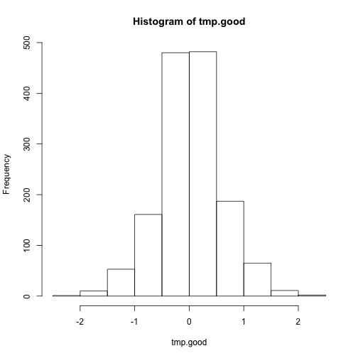
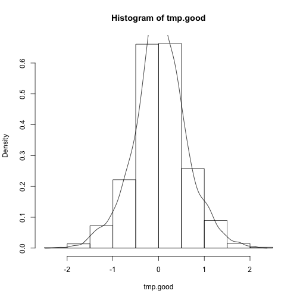
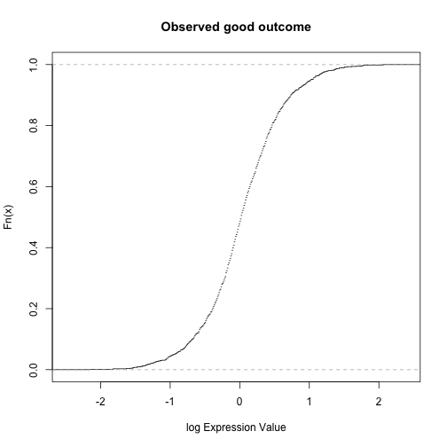

Module1, Lecture 7: Introduction to Differential Expression Analysis
========================================================
author: M Hallett
date: January 2015
autosize:true
font-family: 'Helvetica' 
#output: beamer-presentation 

## gene expression, differential expresion, patient clinical outcome, descriptive statistics, hypothesis testing


Differential Expression - A simple approach
========================================================
* A natural question is to ask whether a gene displays differential expression
between good and bad outcome patients.


```r
source("~/repos/comp364/src/hucMini.R")  # students should change this to ~/cs364/src/hucMini.R 
dataset.collections <- c("miniTCGA", "vanvliet", "nki") 
huc <- huc.load(dataset.collections, "~/repos/comp364/data")  # students should change this to ~/cs364/data
names(huc)
```

```
[1] "miniTCGA" "vanvliet" "nki"     
```

```r
attach(huc$vanvliet)
observed.good <- subset(clinical, !event.5) 
observed.bad <- subset(clinical, event.5)
length(observed.good[,1]); length(observed.bad[,1])
```

```
[1] 726
```

```
[1] 171
```

Differential Expression - A simple approach
========================================================

```r
(probes.for.TP53 <- which( probe.info$gene.name == "TP53" ))
```

```
[1]  1274 10723
```

```r
exprs[probes.for.TP53, observed.good$id][,1:5]  # 1st 5 of 25
```

```
     vanvliet.2 vanvliet.4 vanvliet.5 vanvliet.6 vanvliet.7
[1,]       0.58       0.42       0.68      -0.20      -0.78
[2,]       0.73       0.41       0.95       0.38      -0.27
```

```r
exprs[probes.for.TP53, observed.bad$id][,1:5]   # 1st 5 of 25
```

```
     vanvliet.1 vanvliet.3 vanvliet.10 vanvliet.11 vanvliet.15
[1,]      -1.35       1.04        0.58       -1.21        0.27
[2,]      -0.68       0.98        0.06       -0.46        0.29
```

Differential Expression - A simple approach
========================================================

```r
exprs[probes.for.TP53, observed.good$id][,1:5]  # 1st 5 of 25
```

```
     vanvliet.2 vanvliet.4 vanvliet.5 vanvliet.6 vanvliet.7
[1,]       0.58       0.42       0.68      -0.20      -0.78
[2,]       0.73       0.41       0.95       0.38      -0.27
```

```r
exprs[probes.for.TP53, observed.bad$id][,1:5]   # 1st 5 of 25
```

```
     vanvliet.1 vanvliet.3 vanvliet.10 vanvliet.11 vanvliet.15
[1,]      -1.35       1.04        0.58       -1.21        0.27
[2,]      -0.68       0.98        0.06       -0.46        0.29
```

Differential Expression - A simple approach
========================================================
* Is the observed difference in mean expression of 0.036 (good) versus -0.065 (poor) sufficient
ly large as to conclude that the famous TP53 gene is differentially expressed between good
and poor outcome breast cancer patients? 
* (If so, we'd conclude it was under-expressed in poor outcome patients.)
* A very natural question that could be asked of all ~20,000 genes.
* But there are many issues here.

Differential Expression - A simple approach
========================================================
  - What's the null hypothesis ($H_0$) here?
  - What's the alternative hypothesis ($H_1$)?
  - What are the options for different statistical tests?
  - What about differences between the two probes (whether within good or poor outcome)?

Differential Expression: Descriptive statistics
========================================================
- Let's get a rough idea of what this data looks like.

```r
tmp.good <- c(exprs[probes.for.TP53[1], observed.good$id], exprs[probes.for.TP53[2], observed.good$id])
summary(tmp.good)
```

```
   Min. 1st Qu.  Median    Mean 3rd Qu.    Max. 
-2.1600 -0.3000  0.0200  0.0322  0.3800  2.0600 
```

Differential Expression: Descriptive statistics
========================================================

```r
stem(tmp.good)
```

```

  The decimal point is 1 digit(s) to the left of the |

  -20 | 6
  -18 | 722
  -16 | 3
  -14 | 774332874310
  -12 | 9665544210888644331100
  -10 | 8754327776655553333331111
   -8 | 998877655332211009998866555555322221000
   -6 | 99988887777766665555544333332211100009999887766666665555554444444322
   -4 | 99999888888888887777776665555443332222211111100009999999998888888877+29
   -2 | 99999999888888877777777666666665555554444444433333333222222222221111+96
   -0 | 99999999998888888888888777777777777777666666666555555555554444444444+152
    0 | 00000000000011111111111122222222222222222333333333333344444444444555+144
    2 | 00000000001111111222222233333333333333333334444444555555556666666667+112
    4 | 00000000011111122222233333333334444455555555566666666667777777777789+53
    6 | 00000111222222233333333444455556666777788999900000111122233333333444+4
    8 | 00011244445556666788999001122234455556667788889
   10 | 01122223456666668888999902334455566788999
   12 | 001245577225667789
   14 | 0333700155
   16 | 1735778
   18 | 4
   20 | 66
```
Differential Expression: Descriptive statistics
========================================================

```r
tmp.bad <- c(exprs[probes.for.TP53[1], observed.bad$id], exprs[probes.for.TP53[2], observed.bad$id])
summary(tmp.bad)
```

```
    Min.  1st Qu.   Median     Mean  3rd Qu.     Max. 
-1.75000 -0.46000 -0.10000 -0.06532  0.35750  1.82000 
```

```r
stem(tmp.bad)
```

```

  The decimal point is 1 digit(s) to the left of the |

  -16 | 54
  -14 | 
  -12 | 75422097222111
  -10 | 998774009854332
   -8 | 8621862111000
   -6 | 987754442221099887776511000
   -4 | 8885543110988666655444311000
   -2 | 999888766655444332111110000077776655544433322100
   -0 | 888877666555444333322221987776666555443322111
    0 | 1112256667801123344455566666788999
    2 | 0000111112455777788891334555556678
    4 | 02235677780001114444467889
    6 | 011224668999001233445578
    8 | 134478800124455888
   10 | 3449179
   12 | 489
   14 | 9
   16 | 05
   18 | 2
```
Differential Expression: Histograms
========================================================

```r
hist(tmp.good)
```


***

```r
hist(tmp.bad)
```


Differential Expression: Histograms
========================================================

```r
density.tmp.good <- density(tmp.good)
hist(tmp.good, prob=TRUE)
lines(density.tmp.good)
```


***

```r
density.tmp.bad <- density(tmp.bad)
hist(tmp.bad, prob=TRUE)
lines(density.tmp.bad)
```


Differential Expression: Boxplots
========================================================

```r
boxplot( tmp.good, tmp.bad, names=c("Good Outcome", "Bad Outcome") )
```


Differential Expression: Parametric statistical tests, t-test
========================================================
- Alternative Hypothesis $H_1$: $\mu_{good} - \mu_{bad} \neq 0$</code>.
- Null Hypothesis $H_0$:  $\mu_{good} - \mu_{bad} = 0$.

```r
t.test(tmp.good, tmp.bad, var.equal=TRUE) # two sample t-test
```

```

	Two Sample t-test

data:  tmp.good and tmp.bad
t = 2.7482, df = 1792, p-value = 0.006052
alternative hypothesis: true difference in means is not equal to 0
95 percent confidence interval:
 0.02792591 0.16712508
sample estimates:
  mean of x   mean of y 
 0.03220386 -0.06532164 
```
Differential Expression: Parametric statistical tests, t-test
========================================================
- Alternative Hypothesis $H_1$: $\mu_{good} - \mu_{bad} \neq 0$</code>.
- Null Hypothesis $H_0$:  $\mu_{good} - \mu_{bad} = 0$.

```r
t.test(tmp.good, tmp.bad)   # by default differences in variance are not considered (Welch test)
```

```

	Welch Two Sample t-test

data:  tmp.good and tmp.bad
t = 2.5702, df = 478.53, p-value = 0.01047
alternative hypothesis: true difference in means is not equal to 0
95 percent confidence interval:
 0.02296662 0.17208437
sample estimates:
  mean of x   mean of y 
 0.03220386 -0.06532164 
```

Differential Expression: Non-parametric statistical tests, Wilcoxon
========================================================
- Alternative Hypothesis $H_1$: The location shift is not equal to 0.
- Null Hypothesis $H_0$:  It is equal to 0.

```r
wilcox.test(tmp.good, tmp.bad)
```

```

	Wilcoxon rank sum test with continuity correction

data:  tmp.good and tmp.bad
W = 272210, p-value = 0.005516
alternative hypothesis: true location shift is not equal to 0
```


Differential Expression: Empirical Cumulative Probability Distribution
========================================================

```r
ecdf.good <- ecdf(tmp.good) # computes an empirical CDF. Important for plotting
ecdf.good(0.3)   # 30th percentile.
```

```
[1] 0.7024793
```

```r
plot(ecdf.good, main="Observed good outcome", xlab = "log Expression Value")
```


Differential Expression: Empirical Cumulative Probability Distribution
========================================================

```r
plot(ecdf.good, main="Observed good outcome", xlab = "log Expression Value",
        do.points=FALSE)
```


Differential Expression: Empirical Cumulative Probability Distribution
========================================================

```r
ecdf.bad <- ecdf(tmp.bad) # computes an empirical CDF. Important for plotting
plot(ecdf.bad, main="Observed bad outcome", xlab = "log Expression Value",
        do.points=FALSE)
```


Differential Expression: Non-parametric statistical tests, Kolmogorov-Smirnoff
========================================================
- Alternative Hypothesis $H_1$: (Intuitively) the cdf of tmp.good is not equal to the cdf of tmp.bad.<br>
- Null Hypothesis $H_0$:  They are equal.

```r
ks.test(tmp.good, tmp.bad)
```

```

	Two-sample Kolmogorov-Smirnov test

data:  tmp.good and tmp.bad
D = 0.12182, p-value = 0.0005411
alternative hypothesis: two-sided
```
Differential Expression: Non-parametric statistical tests, Kolmogorov-Smirnoff
========================================================
* A note here: one can assign the results of such tests and query the individual pieces of information
related to the test.


```r
ks.result <- ks.test(tmp.good, tmp.bad)
names(ks.result)
```

```
[1] "statistic"   "p.value"     "alternative" "method"      "data.name"  
```

```r
ks.result$p.value
```

```
[1] 0.0005410967
```
 
Differential Expression: Is the good outcome CDF near a normal distribution?
========================================================

```r
summary(ecdf.good)
```

```
Empirical CDF:	  277 unique values with summary
    Min.  1st Qu.   Median     Mean  3rd Qu.     Max. 
-2.16000 -0.65000  0.04000  0.03249  0.73000  2.06000 
```

```r
#range <- seq(min(tmp.good), max(tmp.good), 0.01)

#sample.from.range <- pnorm(range, mean=mean(ecdf.good), sd=sqrt(var(ecdf.good)))
#lines(range, sample.from.range, lty=3)
#ks.test(tmp.good, sample.from.range)
```


COMP-364 (c) M Hallett, BCI-McGill
========================================================


