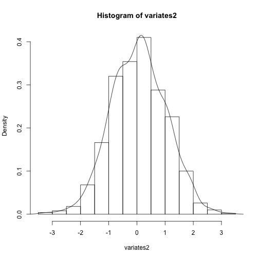

Module 1, Lecture 8: Probability Distributions in R
========================================================
author: M Hallett
date: January 2015
autosize:true
font-family: 'Helvetica' 
#output: beamer-presentation 

## normal distribution, generators of variates, pdf, cdf

## COMP-364 Tools for the Life Sciences

Probability Distributions
========================================================
- R has functionality to work with many different probability distributions.
- This includes functionality for the probability distribution function (pdf), the cummulat
ive distribution function (cdf), quantiles, simulation etc.
- The different functions have the same form:
- <code>d</code> for the pdf
- <code>c</code> for the cdf
- <code>q</code> for the quantile
- <code>r</code> to generate a random simulation from the distribution.

Probability Distributions
========================================================

```r
? Distributions
```

Probability Distributions: Normal
========================================================

```r
help(norm)
```

Probability Distributions: Normal
========================================================

```r
variates <- rnorm( n=100, mean = 0, sd = 1 ) 
# generates 100 variates from a normal distribution with mean 0 and standard deviation 1
variates[1:10] 
```

```
 [1] -0.995268372  1.620340540 -1.146428904 -1.062695423  0.218301861
 [6]  0.001419726 -1.349889993 -1.327718085  0.102426227  0.058622041
```
Probability Distributions: Normal n=100
========================================================

```r
hist(variates, prob=TRUE)
variates.density <- density(variates)
lines(variates.density)
```

 
Probability Distributions: Normal n=1000
========================================================

```r
variates2 <- rnorm( n=1000, mean = 0, sd = 1 )
hist(variates2, prob=TRUE)
lines(density(variates2))
```

 

Probability Distributions: Normal n=10,000
========================================================

```r
variates2 <- rnorm( n=10000, mean = 0, sd = 1 )
hist(variates2, prob=TRUE)
lines(density(variates2))
```

 

Probability Distributions: Normal density function
========================================================
The <code>dnorm</code> function returns the height of the normal curve at some value along
the x-axis (density, pdf).

```r
xaxis <- seq( from = -3, to = 3, by = 0.1) 
yaxis <- lapply( xaxis, dnorm )   
# lapply (list apply) applies dnorm() to each element of xaxis
xaxis
```

```
 [1] -3.0 -2.9 -2.8 -2.7 -2.6 -2.5 -2.4 -2.3 -2.2 -2.1 -2.0 -1.9 -1.8 -1.7
[15] -1.6 -1.5 -1.4 -1.3 -1.2 -1.1 -1.0 -0.9 -0.8 -0.7 -0.6 -0.5 -0.4 -0.3
[29] -0.2 -0.1  0.0  0.1  0.2  0.3  0.4  0.5  0.6  0.7  0.8  0.9  1.0  1.1
[43]  1.2  1.3  1.4  1.5  1.6  1.7  1.8  1.9  2.0  2.1  2.2  2.3  2.4  2.5
[57]  2.6  2.7  2.8  2.9  3.0
```
Probability Distributions: Normal density function
========================================================

```r
yaxis[1:4]
```

```
[[1]]
[1] 0.004431848

[[2]]
[1] 0.005952532

[[3]]
[1] 0.007915452

[[4]]
[1] 0.01042093
```
Probability Distributions: Normal density function
========================================================
The <code>dnorm</code> function returns the height of the normal curve at some value along
the x-axis (density, pdf).

```r
plot( xaxis, yaxis )
```

 

Probability Distributions: Normal cumulative function (cdf)
========================================================
The <code>pnorm</code> function is the cumulative distribution function (cdf). It gives the
 area to the right of the given point.

```r
pnorm( 0, mean=0, sd=1 )
```

```
[1] 0.5
```

```r
pnorm( 3, mean=0, sd=1, lower.tail = TRUE )
```

```
[1] 0.9986501
```
Probability Distributions: Normal cumulative function (cdf)
========================================================

```r
xaxis <- seq( from = -3, to = 3, by = 0.1)
yaxis <- lapply( xaxis, pnorm )   
# lapply (list apply) applies dnorm() to each element of xaxis
plot( xaxis, yaxis )
```

 

Probability Distributions: Normal quantile function
========================================================
The <code>qnorm</code> function with parameter (fraction) Z can be used to determine the po
int X along the x-axis where Z  of the data is to the "left"

```r
qnorm( 0.5, mean=0, sd=1 )
```

```
[1] 0
```

```r
qnorm( 0.95, mean=0, sd=1 )
```

```
[1] 1.644854
```
Probability Distributions: Normal quantile function
========================================================

```r
xaxis <- seq( from = -3, to = 3, by = 0.1)
yaxis <- lapply( xaxis, dnorm )   
# lapply (list apply) applies dnorm() to each element of xaxis
xaxis
```

```
 [1] -3.0 -2.9 -2.8 -2.7 -2.6 -2.5 -2.4 -2.3 -2.2 -2.1 -2.0 -1.9 -1.8 -1.7
[15] -1.6 -1.5 -1.4 -1.3 -1.2 -1.1 -1.0 -0.9 -0.8 -0.7 -0.6 -0.5 -0.4 -0.3
[29] -0.2 -0.1  0.0  0.1  0.2  0.3  0.4  0.5  0.6  0.7  0.8  0.9  1.0  1.1
[43]  1.2  1.3  1.4  1.5  1.6  1.7  1.8  1.9  2.0  2.1  2.2  2.3  2.4  2.5
[57]  2.6  2.7  2.8  2.9  3.0
```
Probability Distributions: Normal quantile function
========================================================

```r
plot( xaxis, yaxis ) 
abline( v = qnorm( 0.95, mean=0, sd=1 ), col="red" ) # labels 95th-quantile
```

 


COMP-364 (c) M Hallett, BCI-McGill
========================================================


