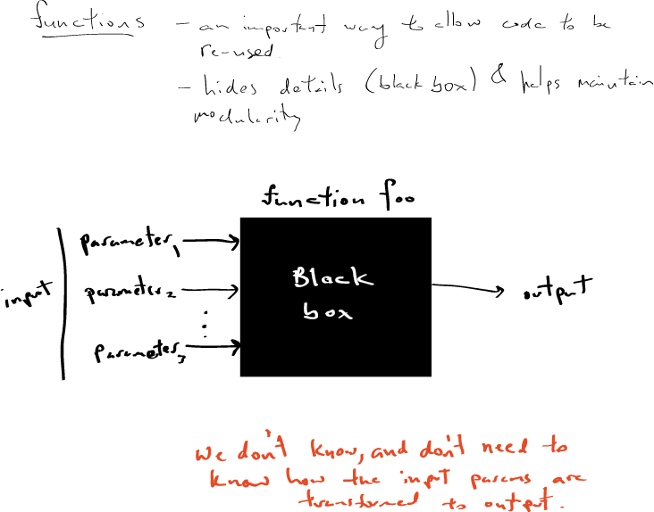
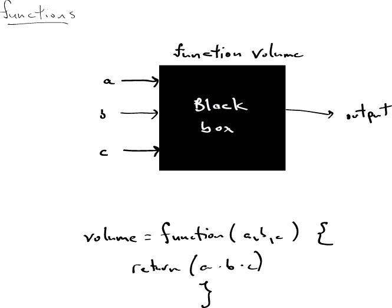
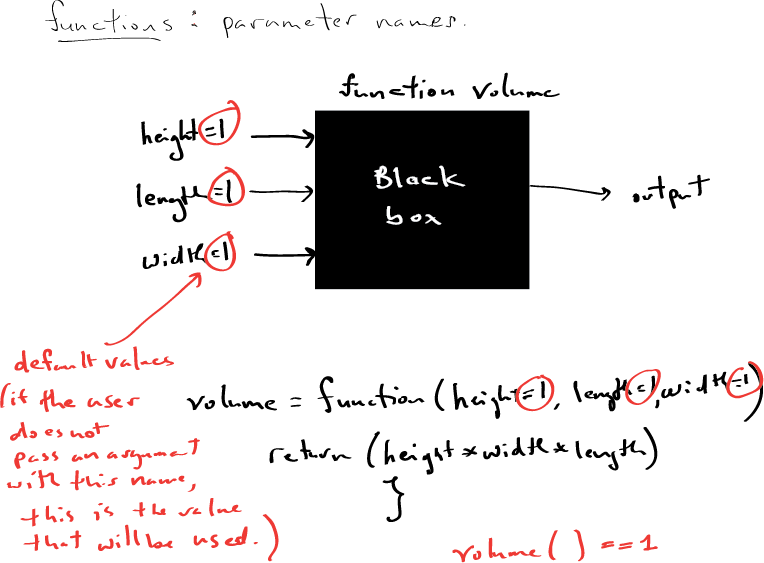
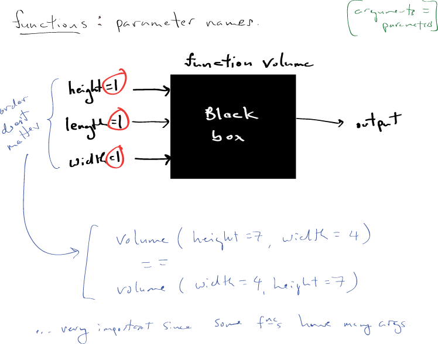

Module 1, Lecture 9: Functions in R
========================================================
author: M Hallett
date: January 2015
autosize:true
font-family: 'Helvetica' 
#output: beamer-presentation 

## functions, recursion, dynamic programming

## COMP-364 Tools for the Life Sciences

R: functions
========================================================
- Functions are an important tool for making segements of code reusable.

```r
my.function <- function() {
  print("hi")
}

my.function()
```

```
[1] "hi"
```

R: functions
========================================================

```r
my.function2 <- function(x) {
  print(x)
}

my.function2(4)
```

```
[1] 4
```
R: functions
========================================================
- Each morning Daniel wakes up and declares "I love you teen pop star X, let me count the ways."

```r
my.function3 <- function( name, times ) {
  for (i in 1:times) {
      cat("\ndaniel loves ", name)
  }
}
```

R: functions
========================================================
- Each morning Daniel wakes up and declares "I love you teen pop star X, let me count the ways."

```r
# day 1
my.function3("katy perry", 2)
```

```

daniel loves  katy perry
daniel loves  katy perry
```

```r
# day 2 
my.function3("taylor swift", 3)
```

```

daniel loves  taylor swift
daniel loves  taylor swift
daniel loves  taylor swift
```
R: Functions 
========================================================



R: Functions 
========================================================


 
R: Functions (2)
========================================================

```r
volume <- function(x, y, z) {
  return(x * y * z)
  }

volume(5, 5, 1)
```

```
[1] 25
```

R: Functions (2)
========================================================

```r
volume.vers2 <- function(height=1, width=1, length=1) {
  return(height * width *length)
}
volume.vers2(height = 5)
```

```
[1] 5
```
R: Functions (2)
========================================================

```r
volume.vers2()
```

```
[1] 1
```

```r
(volume.vers2(height=5, width=7) == volume.vers2(width=7, height=5))
```

```
[1] TRUE
```

R: Functions (2.5)
========================================================


R: Functions (2.5)
========================================================



R: Functions, recursion (3)
========================================================
- The factorial function.
- $n! = 1 \cdot 2 \cdot 3 \cdot \ldots \cdot (n-1) \cdot n$ and $0! = 1$.
- Important in the computation of many probabilities and statistics.


```r
factorial <- function( n ) {
  if ((n == 1) || (n==0)) return(1)
  else  return( n*factorial( n-1 ) )
}
```

R: Functions, recursion (3)
========================================================
- The factorial function.
- $n! = 1 \cdot 2 \cdot 3 \cdot \ldots \cdot (n-1) \cdot n$ and $0! = 1$.


```r
factorial(0)
```

```
[1] 1
```

```r
factorial(5)
```

```
[1] 120
```

R: Functions, recursion (4)
========================================================
- Binary Search, the olde classic. Remember phone books?
- Daniel has lost the integer X in a big sorted vector of integers ... again. Can you help
Daniel find the number X?

```r
binary.search <- function( sorted.big.vector, X) {
  res <- binary.search.helper( sorted.big.vector, X,
                                lower=1, upper = length(sorted.big.vector))
  if (res==-1) print("Oh Daniel") else {
      print("Found it Daniel at index "); print(res) }
}
```
R: Functions, recursion (4)
========================================================

```r
binary.search.helper <- function( sorted.big.vector, X, lower, upper ) {
  if (lower == upper) {
    if (sorted.big.vector[lower] == X) return(lower) else return(-1) } else
  {
    mid <- lower + floor( (upper-lower) / 2 )
    if (X <= sorted.big.vector[mid]) {
        return( binary.search.helper( sorted.big.vector, X, lower, mid)) }
    else {
        return( binary.search.helper( sorted.big.vector, X, mid+1, upper)) }
      }
  }
```

R: Functions, recursion (4)
========================================================

```r
bv <- c( 4, 9, 11, 37, 45, 67, 72, 99, 101, 8932)
binary.search(bv, 9)
```

```
[1] "Found it Daniel at index "
[1] 2
```
- How many steps (***) on average do you think Daniel takes to find the number x?

R: Functions, Fibonacci numbers, recursion
========================================================
-A famous sequence of integers that is "easily" computed recursively
- $f_n = f_{n-1} + f_{n-2}$ where $f(0) = 0$ and $f(1)=1$.
- Top-down approach

```r
fib <- function(n) {

  if ((n==0) || (n==1)) return(n) else return( fib(n-1) + fib(n-2) )
}
```
R: Functions, Fibonacci numbers, recursion
========================================================
-A famous sequence of integers that is "easily" computed recursively
- $f_n = f_{n-1} + f_{n-2}$ where $f(0) = 0$ and $f(1)=1$.
- Top-down approach

```r
fib(0); fib(1); fib(2); fib(3); fib(5)
```

```
[1] 0
```

```
[1] 1
```

```
[1] 1
```

```
[1] 2
```

```
[1] 5
```

R: Functions, Fibonacci numbers, recursion
========================================================

```r
system.time(fib(15))
```

```
   user  system elapsed 
  0.002   0.000   0.003 
```

```r
#system.time(fib(30))  # Ctrl-C after elapsed time of 11.905
```

R: Functions, Fibonacci numbers, dynamic programming
========================================================
- Bottom up approach.
- Two different implementations. Why is the following more efficient?

```r
fib2 <- function( n ) {
 if ((n==0) || (n==1)) return(n)

 F <- vector( mode = "integer", length = n+1 )
 
 F[[1]] <- 0; F[[2]] <- 1   
 
 # So F[i] has the $(i-1)^{th}$ Fib number 
 # (since lists are indexed from 1)
 
 for (i in 3:(n+1)) {
   F[[i]] <- F[[i-1]] + F[[i-2]]
   }
 return(F[[n+1]])
 }
```
R: Functions, Fibonacci numbers, dynamic programming
========================================================

```r
(fib2(15) == fib(15))
```

```
[1] TRUE
```

```r
system.time(fib(25))
```

```
   user  system elapsed 
  0.292   0.004   0.298 
```

```r
system.time(fib2(25))
```

```
   user  system elapsed 
      0       0       0 
```

COMP-364 (c) M Hallett, BCI-McGill
========================================================


